<div align="center">

</div>


> <p dir="RTL"> 
با توجه به داده بانک جهانی به سوالات زیر پاسخ دهید. برای استفاده از داده از سه فایل زیر استفاده نمایید.
داده نام کشورها: WDICountry
داده نام سری های زمانی: WDISeries
داده کل: WDIData
در صورتی که داده را در اختیار ندارید می توانید از بسته WDI استفاده نموده و داده های مورد نظر را استخراج نمایید.
</p>

***

<p dir="RTL">
۱. ده کشور فقیر دنیا را بیابید. نمودار درآمد روزانه آنها را رسم کنید. چند درصد از اعضای این کشورها زیر خط فقر هستند؟ متوسط عمر در این کشورها چقدر است؟
</p>


<p dir="RTL">
بیست کشور فقیر
بر اساس میانگین ۷ سال اخیر
</p>

```{r q11, echo=FALSE,message=FALSE, warning=FALSE}
library(WDI)
library(readr)
library(dplyr)
data = read_csv("~/Downloads/WDI_csv/WDIData.csv")


data %>% filter(`Indicator Code` == "SI.POV.LMIC") ->pov

pov$mean <- rowMeans(subset(pov, select = c("2010", "2011","2012","2013","2014","2015", "2016")), na.rm = TRUE)

pov %>% filter(mean != "NaN") -> pov
pov[rev(order(pov$mean)),] -> pov
head(pov$`Country Name`, 20)
```


<p dir="RTL">
درآمد روزانه کشورهای فقیر در یک خانواده
بر اساس ۷ سال اخیر
</p>

```{r q12, echo=FALSE,message=FALSE, warning=FALSE}
library(WDI)
library(readr)
library(dplyr)
data = read_csv("~/Downloads/WDI_csv/WDIData.csv")


data%>% filter(`Indicator Code`=="SI.SPR.PCAP") -> income

income$mean <- rowMeans(subset(income, select = c("2010", "2011","2012","2013","2014","2015", "2016")), na.rm = TRUE)

income %>% filter(mean != "NaN") -> income
names = c("Congo, Dem. Rep.", "Madagascar", "Burundi", "Malawi","Guinea-Bissau" , "Mozambique","Rwanda" ,"Sierra Leone", "Niger","Tanzania","Lesotho","Zambia","Benin","Burkina Faso","Low income","Togo" ,"Liberia" ,"Timor-Leste", "Guinea" ,"Sao Tome and Principe")
income %>% filter(`Country Name` %in% names) %>% select(`Country Name`, mean)->income
income
```


<p dir="RTL">
متوسط عمر در کشورهای فقیر بر اساس ۷ سال اخیر
</p>

```{r q13, echo=FALSE,message=FALSE, warning=FALSE}
library(WDI)
library(readr)
library(dplyr)

data = read_csv("~/Downloads/WDI_csv/WDIData.csv")

p = WDIsearch(string = "life", cache = NULL)
data %>% filter(`Indicator Code` == "SP.DYN.LE00.IN") ->pov
pov$mean <- rowMeans(subset(pov, select = c("2010", "2011","2012","2013","2014","2015", "2016")), na.rm = TRUE)

pov %>% filter(mean != "NaN") -> pov
names = c("Congo, Dem. Rep.", "Madagascar", "Burundi", "Malawi","Guinea-Bissau" , "Mozambique","Rwanda" ,"Sierra Leone", "Niger","Tanzania")
pov %>% filter(`Country Name` %in% names) %>% select(`Country Name`, mean)->pov
pov

```

```{r q14, echo=FALSE,message=FALSE, warning=FALSE}
```


***

<p dir="RTL">
۲. تراژدی روآندا: بر اساس داده های امید به زندگی ابتدا نمودار سالانه نمودار جعبه ایی امید به زندگی کشورها را رسم نمایید(در یک نمودار!). سپس سری زمانی امید به زندگی روآندا را به آن اضافه کنید. چه می بینید؟ چند میلیون نفر کشته شدند؟
</p>


<p dir="RTL">
حدود یک میلیون نفر در روآندا کشته شدند. (در یک سال)
کاهش امید به زندگی هم به این علت است.
(خط بنفش روآندا را نشان میدهد)
</p>

```{r q2, echo=FALSE,message=FALSE, warning=FALSE}
library(WDI)
library(readr)
library(dplyr)
library(reshape)
library(stats)
library(tidyr)
library(ggplot2)
data = read_csv("~/Downloads/WDI_csv/WDIData.csv")

data %>% filter(`Indicator Code` == "SP.DYN.LE00.IN") -> life
life = life[,-3]
life = life[,-3]
life = life[,-2]
life = life[, 1:58]
life <- life %>% gather(Year, Exp, 2:58)
life %>% filter(`Country Name` %in% c("Rwanda")) -> rw
ggplot(mapping = aes(x = Year, y = Exp)) + geom_boxplot(data = life) + geom_point(data = rw, color = "purple", size = 5) + theme(axis.text.x = element_text(angle=-90, vjust=0.5))

```


***

<p dir="RTL">
۳. نمودار امید به زندگی و هزینه های بهداشتی را رسم کنید. چه نتیجه ایی می گیرید؟
</p>

<p dir="RTL">
با بالا رفتن بهداشت و هزینه های بهداشتی، میانگین عمر هم زیاد میشود.
</p>

```{r q3, echo=FALSE,message=FALSE, warning=FALSE}
library(WDI)
library(readr)

data = read_csv("~/Downloads/WDI_csv/WDIData.csv")

p = WDIsearch(string = "health", cache = NULL)
data %>% filter(`Indicator Code` == "SP.DYN.LE00.IN") ->life

data %>% filter(`Indicator Code` == "SH.XPD.CHEX.PP.CD") ->exp

life$mean <- rowMeans(subset(life, select = c("2010", "2011","2012","2013","2014","2015", "2016")), na.rm = TRUE)
exp$mean <- rowMeans(subset(exp, select = c("2010", "2011","2012","2013","2014","2015", "2016")), na.rm = TRUE)

life %>% filter(mean != "NaN") -> life
exp %>% filter(mean != "NaN") -> exp

life %>% select(`Country Name`, life = mean) -> life
exp %>% select(`Country Name`, exp = mean)-> exp
fin = inner_join(life, exp)
ggplot(fin , aes(y = exp, x = life)) + geom_point(color = "purple")
```


***

<p dir="RTL">
۴. آیا قدرت خرید خانواده های ایرانی در ۵۰ سال اخیر افزایش یافته است؟ برای این کار از داده های اقتصادی خانوار استفاده کنید.
</p>


<p dir="RTL">
بله. تست فرض نیز تغییر میانگین را تایید میکند. 
</p>

```{r q4,message=FALSE, warning=FALSE}
library(WDI)
library(readr)

data = read_csv("~/Downloads/WDI_csv/WDIData.csv")

p = WDIsearch(string = "consumption", cache = NULL)

data %>% filter(`Indicator Code` == "NE.CON.PRVT.CD") ->h

h %>% filter(`Country Name` == "Iran, Islamic Rep.") -> h


h %>% select_if(~sum(!is.na(.)) > 0) ->h


chisq.test(h[5:60])
h = h[5:60]
h = t(h)
h = as.data.frame(h)
h <- add_rownames(h, "year")
colnames(h) = c("year", "value")
ggplot(h, aes(x = year, y = value)) + geom_point() +  theme(axis.text.x = element_text(angle=-90, vjust=0.5))
```


***

<p dir="RTL">
۵. رشد اقتصادی ایران را با کشورهای دیگر در طول ۲۰ سال گذشته بر حسب بیست شاخص های اقتصادی مهم مانند تولید ناخالص ملی، تورم و … ارزیابی کنید! (برای هر شاخص از تصویرسازی استفاده کنید.)
</p>


<p dir="RTL">
شاخصهای اقتصادی و مقایسه ایران با میانگین بقیه جهان. 
(به دلیل موجود نبودن تعداد زیادی از شاخصها از ۱۱ شاخص استفاده شده است.)
</p>

<div align="center">  
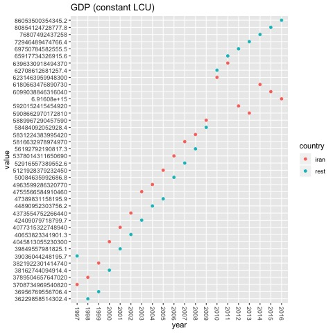 
</div>

<div align="center">    
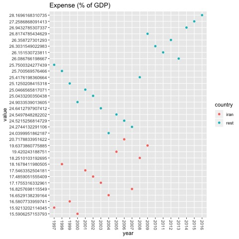
</div>

<div align="center">    
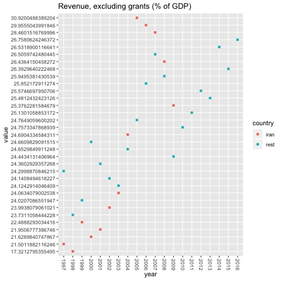 
</div>

<div align="center">   
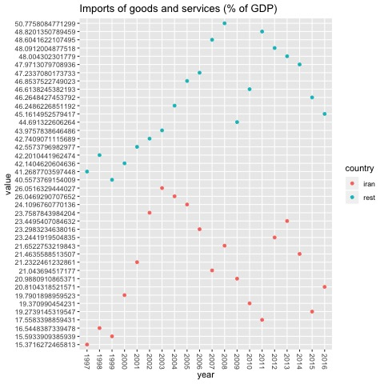 
</div>

<div align="center"> 
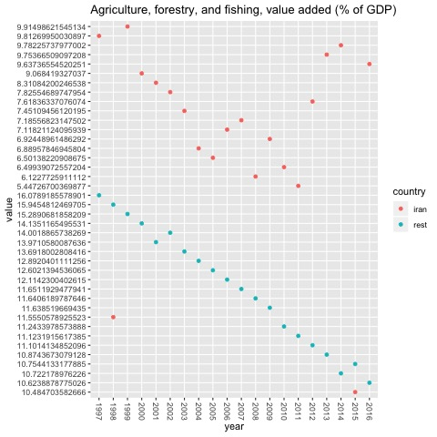 
</div>

<div align="center"> 
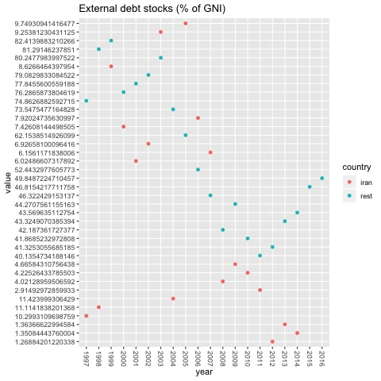 
</div>

<div align="center">    
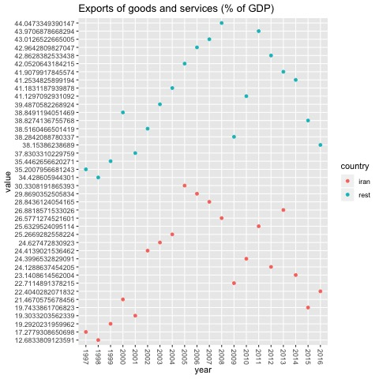
</div>

<div align="center">  
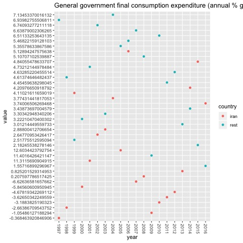 
</div>

<div align="center">   
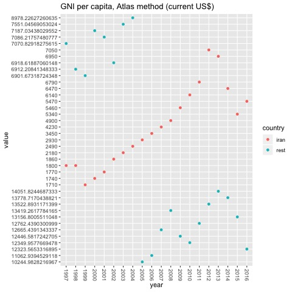 
</div>

<div align="center">    
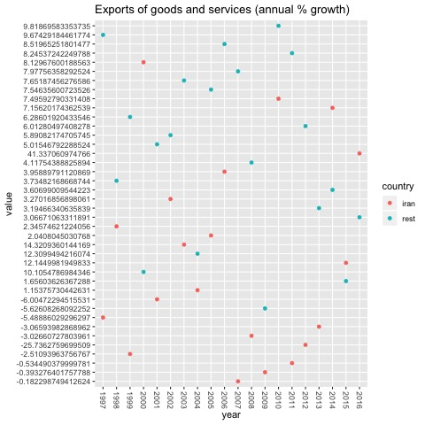 
</div>

<div align="center">    
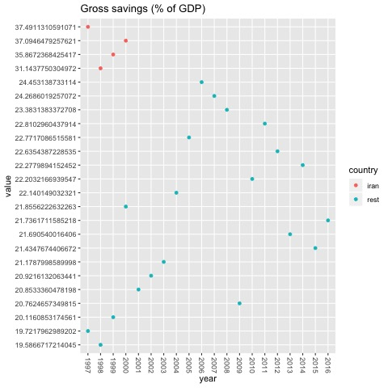
</div>
 
```{r q5, echo=FALSE,message=FALSE, warning=FALSE, eval = FALSE}
library(WDI)
library(readr)
library(jpeg)
data = read_csv("~/Downloads/WDI_csv/WDIData.csv")


indic = list("NY.GDP.MKTP.KN","GC.XPN.TOTL.GD.ZS", "GC.REV.XGRT.GD.ZS", "NE.IMP.GNFS.ZS", "NV.AGR.TOTL.ZS" , "DT.DOD.DECT.GN.ZS", "NE.EXP.GNFS.ZS", "NE.CON.GOVT.KD.ZG", "NY.GNP.PCAP.CD", "NE.EXP.GNFS.KD.ZG", "NY.GNS.ICTR.ZS")

alls = NULL
for (ind in 1:11){

  str = indic[ind]
  data %>% filter(`Indicator Code` == str) ->gdp
  name = gdp[1,3]
  name = name[[1]]
  se= c("Country Code","1997", "1998", "1999", "2000", "2001", "2002", "2003", "2004", "2005", "2006", "2007", "2008", "2009","2010", "2011","2012","2013","2014","2015", "2016")
  gdp = gdp[,se]

  gdp %>% filter(`Country Code` == "IRN") -> irn
  gdp %>% filter(`Country Code` != "IRN") -> rest
  restmean = colMeans(rest[,-1], na.rm = TRUE)
  irnmean = colMeans(irn[,-1], na.rm = TRUE)
  fac1 = cbind(irnmean, restmean)
  fac1 = as.data.frame(fac1)
  fac1 <- add_rownames(fac1, "year")
  fac1gg = data.frame(year = 0, value = 0 ,country =0, type = 0)
  s = 1
  for (i in 1:(nrow(fac1))){
    x = fac1[i,]
    fac1gg[s,] = c(x$year, x$irnmean, "iran", name)
    s = s+1
    fac1gg[s,] = c(x$year, x$restmean, "rest", name)
    s = s + 1
  
  }
  fac1gg %>% filter(value != "NaN") -> fac1gg
  alls = rbind(alls, fac1gg)
  
 # mypath <- file.path("~/Desktop/Data Analysis/HW10/images/",paste("myplot_", ind, ".jpg", sep = ""))
  #jpeg(file=mypath)
 
  ggplot(fac1gg, aes(x= year , y = value , color = country)) + geom_point() + ggtitle(name) +  theme(axis.text.x = element_text(angle=-90, vjust=0.5))
  
 # dev.off() 
  
}


```

<p dir="RTL">
شاخصهای بهداشتی و مقایسه ایران با میانگین بقیه جهان. 
</p>


<div align="center">  
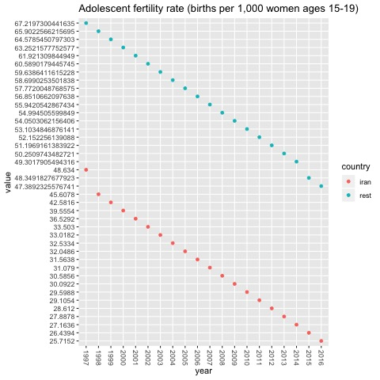
</div>

<div align="center">    
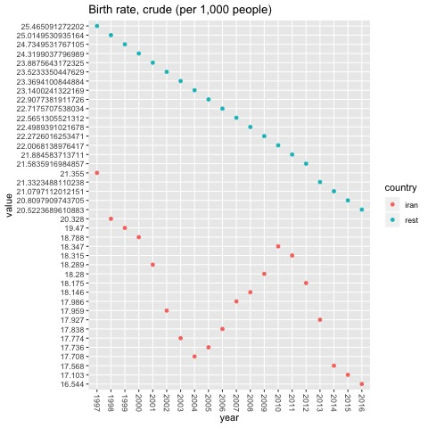 
</div>

<div align="center">    
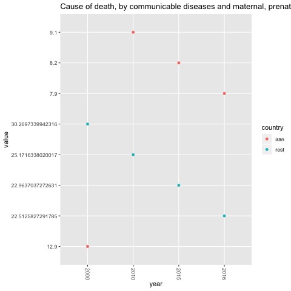
</div>

<div align="center">   
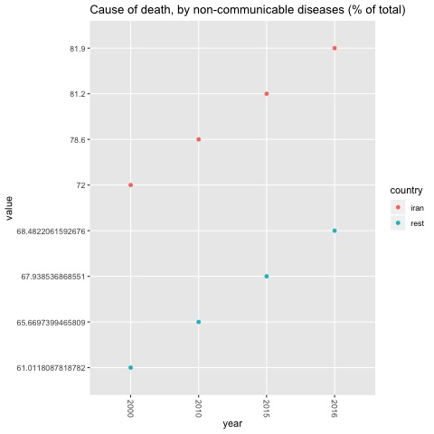 
</div>

<div align="center">    
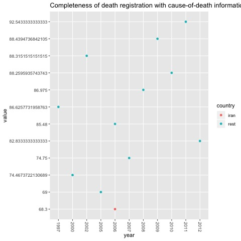 
</div>


<div align="center">    
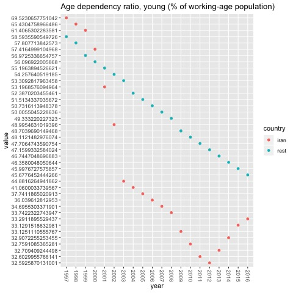 
</div>


<div align="center">    
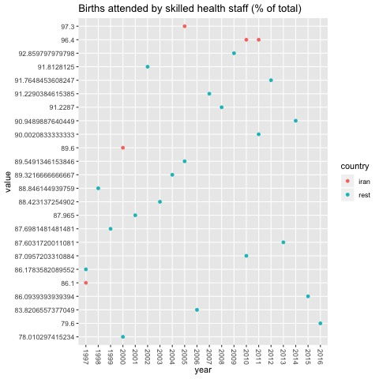 
</div>


<div align="center">    
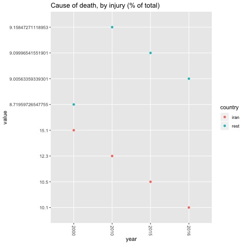 
</div>

<div align="center">    
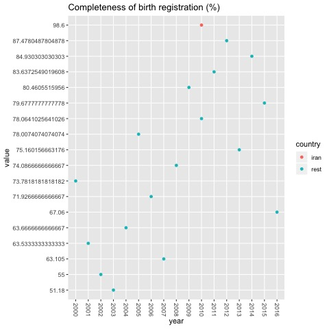 
</div>

<div align="center">    
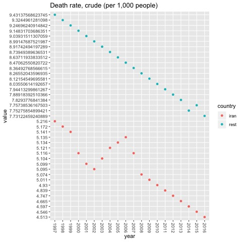 
</div>


<div align="center">    
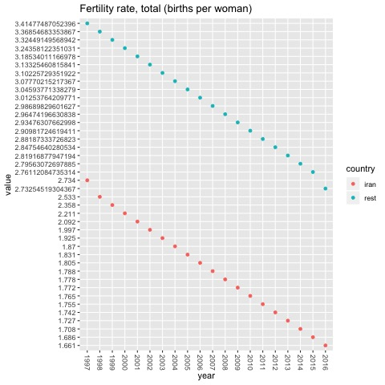 
</div>

<div align="center">    
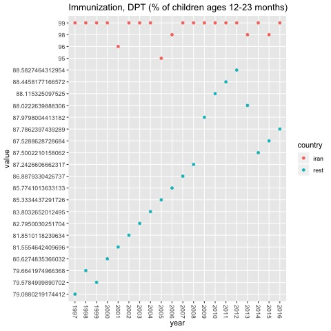 
</div>

<div align="center">    
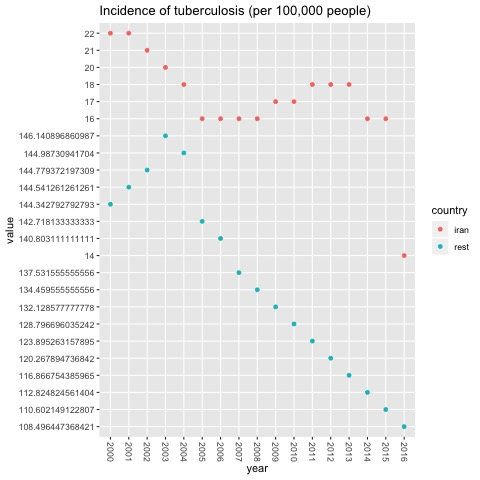 
</div>


<div align="center">    
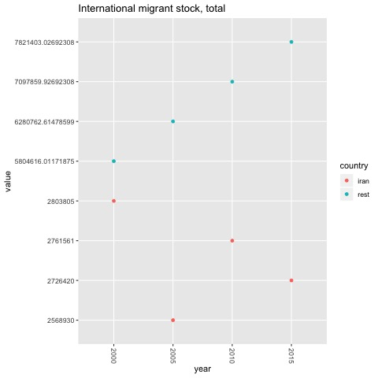 
</div>


<div align="center">    
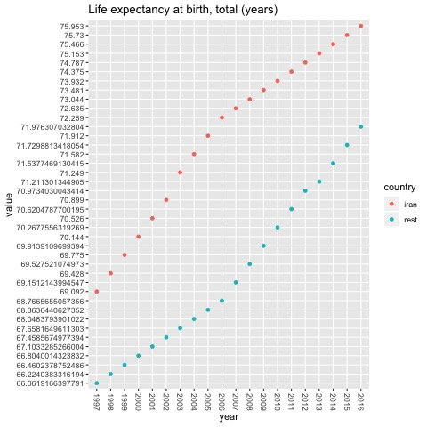 
</div>


<div align="center">    
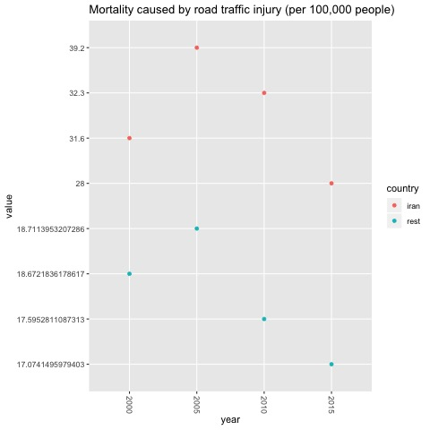 
</div>


<div align="center">    
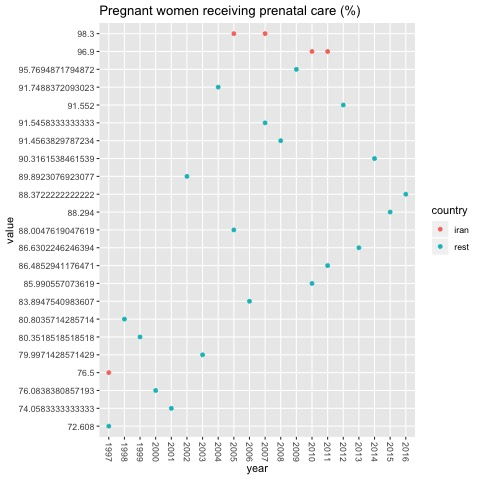 
</div>


<div align="center">    
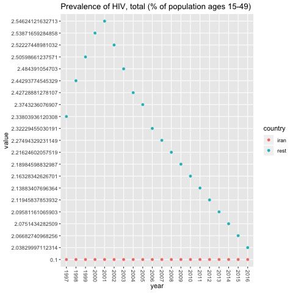 
</div>


<div align="center">    
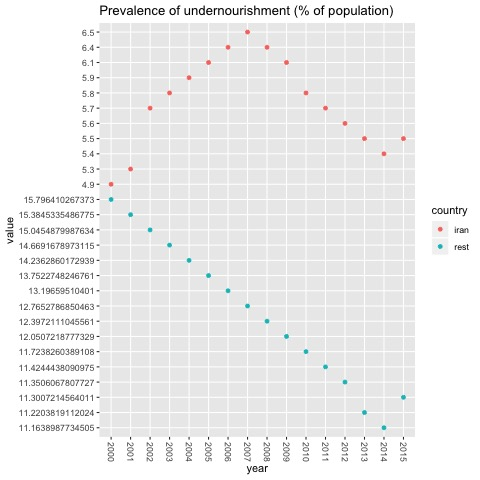 
</div>


<div align="center">    
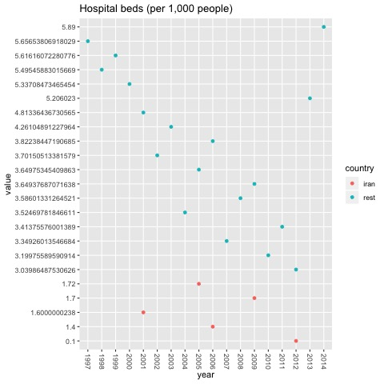 
</div>
```{r q52, echo=FALSE,message=FALSE, warning=FALSE, eval=FALSE}
```

<p dir="RTL">
شاخصهای آموزشی و مقایسه ایران با میانگین بقیه جهان. 
</p>
<div align="center">  
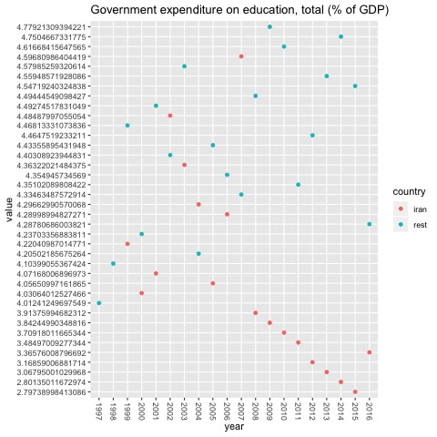
</div>

<div align="center">    
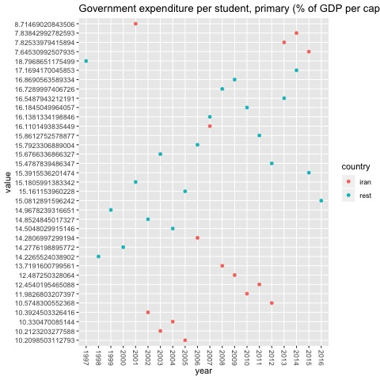 
</div>

<div align="center">    
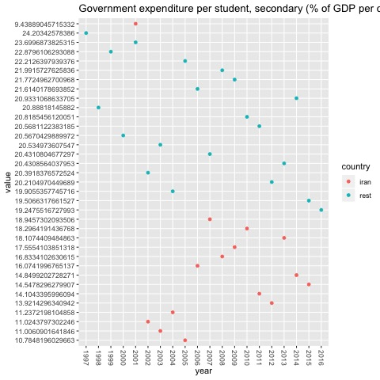
</div>

<div align="center">   
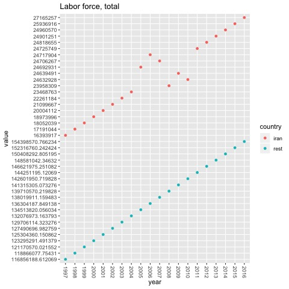 
</div>

<div align="center">    
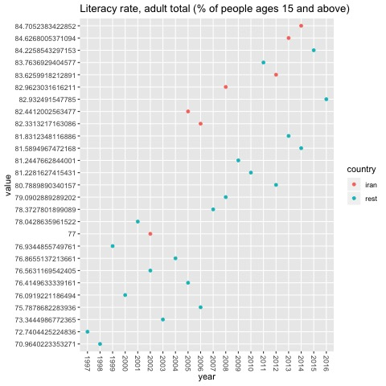 
</div>


<div align="center">    
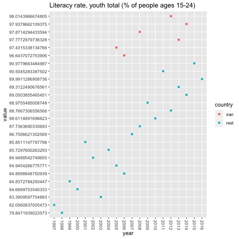 
</div>


<div align="center">    
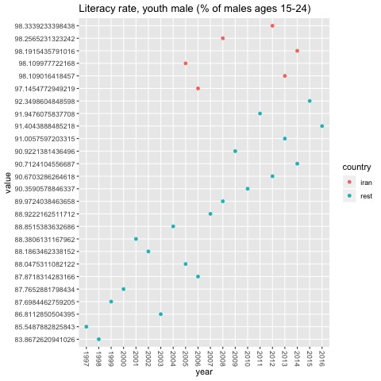 
</div>


<div align="center">    
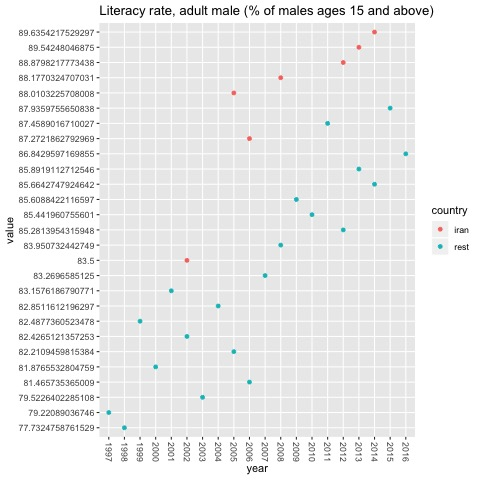 
</div>

<div align="center">    
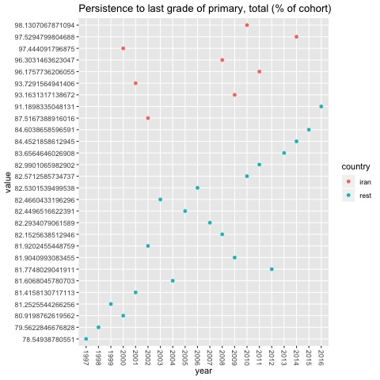 
</div>

<div align="center">    
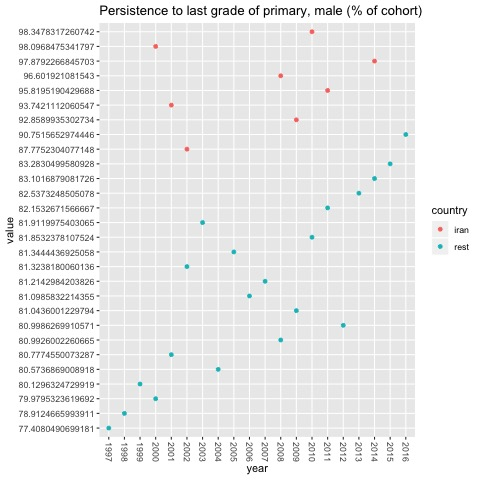 
</div>


<div align="center">    
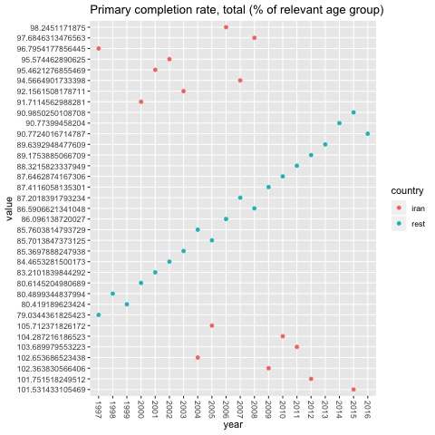 
</div>

<div align="center">    
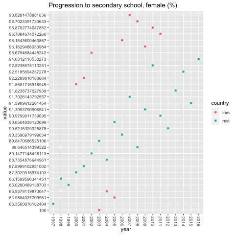 
</div>

<div align="center">    
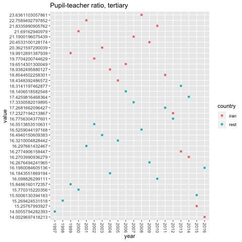 
</div>


<div align="center">    
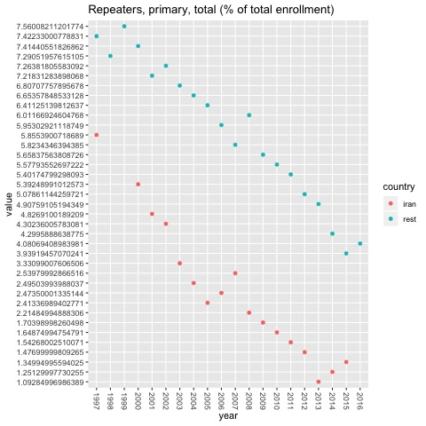 
</div>


<div align="center">    
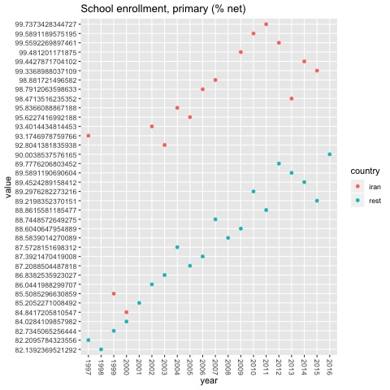 
</div>


<div align="center">    
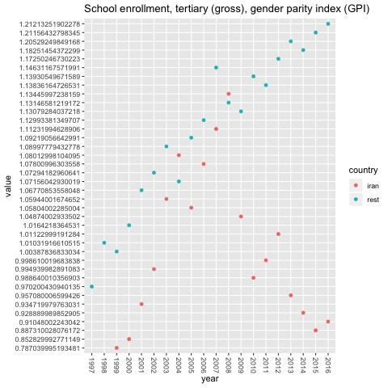 
</div>


<div align="center">    
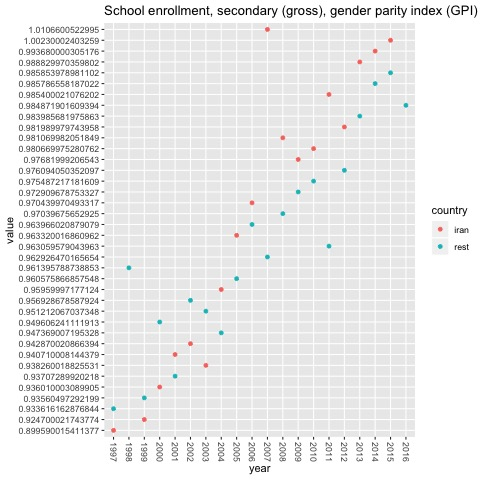 
</div>


<div align="center">    
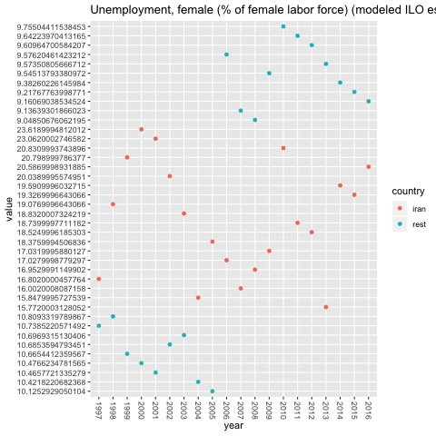 
</div>


<div align="center">    
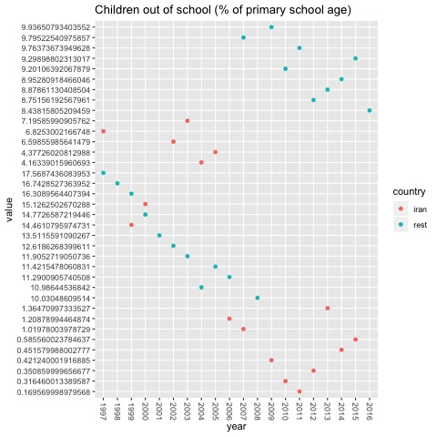 
</div>


<div align="center">    
 
</div>
```{r q53, echo=FALSE,message=FALSE, warning=FALSE, eval=FALSE}
library(WDI)
library(readr)
library(dplyr)
library(ggplot2)

data = read_csv("~/Downloads/WDI_csv/WDIData.csv")

indic = list("SE.XPD.TOTL.GD.ZS", "SE.XPD.PRIM.PC.ZS", "SE.XPD.SECO.PC.ZS", "SL.TLF.TOTL.IN", "SE.ADT.LITR.ZS", "SE.ADT.1524.LT.ZS", "SE.ADT.1524.LT.MA.ZS", "SE.ADT.LITR.MA.ZS", "SE.PRM.PRSL.ZS", "SE.PRM.PRSL.MA.ZS", "SE.PRM.CMPT.ZS", "SE.SEC.PROG.FE.ZS", "SE.TER.ENRL.TC.ZS", "SE.PRM.REPT.ZS", "SE.PRM.NENR", "SE.ENR.TERT.FM.ZS", "SE.ENR.SECO.FM.ZS", "SL.UEM.TOTL.FE.ZS", "SE.PRM.UNER.ZS", "SE.PRM.CMPT.ZS")
alls = NULL
for (i in 1:20){

  str = indic[i]
  data %>% filter(`Indicator Code` == str) ->gdp
  name = gdp[1,3]
  name = name[[1]]
  se= c("Country Code","1997", "1998", "1999", "2000", "2001", "2002", "2003", "2004", "2005", "2006", "2007", "2008", "2009","2010", "2011","2012","2013","2014","2015", "2016")
  gdp = gdp[,se]
  
  gdp %>% filter(`Country Code` == "IRN") -> irn
  gdp %>% filter(`Country Code` != "IRN") -> rest
  restmean = colMeans(rest[,-1], na.rm = TRUE)
  irnmean = colMeans(irn[,-1], na.rm = TRUE)
  fac1 = cbind(irnmean, restmean)
  fac1 = as.data.frame(fac1)
  fac1 <- add_rownames(fac1, "year")
  fac1gg = data.frame(year = 0, value = 0 ,country =0, type = 0)
  s = 1
  for (i in 1:(nrow(fac1))){
    x = fac1[i,]
    fac1gg[s,] = c(x$year, x$irnmean, "iran", name)
    s = s+1
    fac1gg[s,] = c(x$year, x$restmean, "rest", name)
    s = s + 1
    
  }
  fac1gg %>% filter(value != "NaN") -> fac1gg
  alls = rbind(alls, fac1gg)
  
  ggplot(fac1gg, aes(x= year , y = value , color = country)) + geom_point() + ggtitle(name) +  theme(axis.text.x = element_text(angle=-90, vjust=0.5))
  
}

```


***

<p dir="RTL">
۶. در قسمت قبل با استفاده از روش خوشه بندی k-means داده ها را به سه دسته تقسیم کنید. ایران در کدام دسته می گنجد؟ (پیش از خوشه بندی طبیعتا داده را باید پاکسازی و استاندارد سازی نمایید.)
</p>

<p dir="RTL">
دادههای اقتصادی
</p>

```{r q61, echo=FALSE,message=FALSE, warning=FALSE}
library(WDI)
library(readr)
library(dplyr)
library(reshape)


data = read_csv("~/Downloads/WDI_csv/WDIData.csv")
indic = list("NY.GDP.MKTP.KN","GC.XPN.TOTL.GD.ZS", "GC.REV.XGRT.GD.ZS", "NE.IMP.GNFS.ZS", "NV.AGR.TOTL.ZS" , "DT.DOD.DECT.GN.ZS", "NE.EXP.GNFS.ZS", "NE.CON.GOVT.KD.ZG", "NY.GNP.PCAP.CD", "NE.EXP.GNFS.KD.ZG")
data %>% filter(`Indicator Code` %in% indic) -> alls

se= c("Country Code","Indicator Code", "1997", "1998", "1999", "2000", "2001", "2002", "2003", "2004", "2005", "2006", "2007", "2008", "2009","2010", "2011","2012","2013","2014","2015", "2016")
alls = alls[,se]
alls$mean <- rowMeans(subset(alls, select = c("1997", "1998", "1999", "2000", "2001", "2002", "2003", "2004", "2005", "2006", "2007", "2008", "2009","2010", "2011","2012","2013","2014","2015", "2016")), na.rm = TRUE)

bads = alls  %>% filter(mean == "NaN") %>% select(`Country Code`) %>% unique()
alls = alls %>% filter(!(`Country Code` %in% bads$`Country Code`))
alls %>% select(`Country Code`, `Indicator Code`, mean) -> alls

tuna<-melt(alls,id.vars=c("Country Code","Indicator Code"))
tuna %>% select(country= `Country Code`, indicator = `Indicator Code`, variable, value) -> tuna
final = cast(tuna,country~indicator~variable)
final = as.data.frame(final)
#final <- add_rownames(final, "Country")
kcl = kmeans(final, centers = 3)
data %>% select(`Country Name`, code = `Country Code`) -> names
nam = as.data.frame(kcl$cluster)
nam <- add_rownames(nam, "code")
names = full_join(names, nam)
names = names %>% select(`Country Name`, cluster = `kcl$cluster`) %>% na.omit() %>% unique()
print(names, n = 100)


```

<p dir="RTL">
دادههای آموزشی
</p>

```{r q62, echo=FALSE,message=FALSE, warning=FALSE}
library(WDI)
library(readr)
library(dplyr)
library(reshape)


data = read_csv("~/Downloads/WDI_csv/WDIData.csv")
indic = list("SE.XPD.TOTL.GD.ZS", "SE.XPD.PRIM.PC.ZS", "SE.XPD.SECO.PC.ZS", "SL.TLF.TOTL.IN", "SE.ADT.LITR.ZS", "SE.ADT.1524.LT.ZS", "SE.ADT.1524.LT.MA.ZS", "SE.ADT.LITR.MA.ZS", "SE.PRM.PRSL.ZS", "SE.PRM.PRSL.MA.ZS", "SE.PRM.CMPT.ZS", "SE.SEC.PROG.FE.ZS", "SE.TER.ENRL.TC.ZS", "SE.PRM.REPT.ZS", "SE.PRM.NENR", "SE.ENR.TERT.FM.ZS", "SE.ENR.SECO.FM.ZS", "SL.UEM.TOTL.FE.ZS", "SE.PRM.UNER.ZS", "SE.PRM.CMPT.ZS")
data %>% filter(`Indicator Code` %in% indic) -> alls

se= c("Country Code","Indicator Code", "1997", "1998", "1999", "2000", "2001", "2002", "2003", "2004", "2005", "2006", "2007", "2008", "2009","2010", "2011","2012","2013","2014","2015", "2016")
alls = alls[,se]
alls$mean <- rowMeans(subset(alls, select = c("1997", "1998", "1999", "2000", "2001", "2002", "2003", "2004", "2005", "2006", "2007", "2008", "2009","2010", "2011","2012","2013","2014","2015", "2016")), na.rm = TRUE)

bads = alls  %>% filter(mean == "NaN") %>% select(`Country Code`) %>% unique()
alls = alls %>% filter(!(`Country Code` %in% bads$`Country Code`))
alls %>% select(`Country Code`, `Indicator Code`, mean) -> alls
tuna<-melt(alls,id.vars=c("Country Code","Indicator Code"))
tuna %>% select(country= `Country Code`, indicator = `Indicator Code`, variable, value) -> tuna
final = cast(tuna,country~indicator~variable)
final = as.data.frame(final)
#final <- add_rownames(final, "Country")

kcl = kmeans(final, centers = 3)
data %>% select(`Country Name`, code = `Country Code`) -> names
nam = as.data.frame(kcl$cluster)
nam <- add_rownames(nam, "code")
names = full_join(names, nam)
names = names %>% select(`Country Name`, cluster = `kcl$cluster`) %>% na.omit() %>% unique()
print(names, n = 100)
```

<p dir="RTL">
دادههای سلامت
</p>

```{r q63, echo=FALSE,message=FALSE, warning=FALSE}
library(WDI)
library(readr)
library(dplyr)
library(reshape)


data = read_csv("~/Downloads/WDI_csv/WDIData.csv")
indic = list("SP.ADO.TFRT", "SP.DYN.CBRT.IN", "SH.DTH.COMM.ZS", "SH.DTH.NCOM.ZS", "SP.REG.DTHS.ZS", "SP.POP.DPND.YG", "SH.STA.BRTC.ZS", "SH.DTH.INJR.ZS", "SP.REG.BRTH.ZS", "SP.DYN.CDRT.IN", "SP.DYN.TFRT.IN", "SH.IMM.IDPT", "SH.TBS.INCD", "SM.POP.TOTL", "SP.DYN.LE00.IN", "SH.STA.TRAF.P5", "SH.STA.ANVC.ZS", "SH.DYN.AIDS.ZS", "SN.ITK.DEFC.ZS", "SH.MED.BEDS.ZS")
data %>% filter(`Indicator Code` %in% indic) -> alls

se= c("Country Code","Indicator Code", "1997", "1998", "1999", "2000", "2001", "2002", "2003", "2004", "2005", "2006", "2007", "2008", "2009","2010", "2011","2012","2013","2014","2015", "2016")
alls = alls[,se]
alls$mean <- rowMeans(subset(alls, select = c("1997", "1998", "1999", "2000", "2001", "2002", "2003", "2004", "2005", "2006", "2007", "2008", "2009","2010", "2011","2012","2013","2014","2015", "2016")), na.rm = TRUE)

bads = alls  %>% filter(mean == "NaN") %>% select(`Country Code`) %>% unique()
alls = alls %>% filter(!(`Country Code` %in% bads$`Country Code`))
alls %>% select(`Country Code`, `Indicator Code`, mean) -> alls

tuna<-melt(alls,id.vars=c("Country Code","Indicator Code"))
tuna %>% select(country= `Country Code`, indicator = `Indicator Code`, variable, value) -> tuna
final = cast(tuna,country~indicator~variable)
final = as.data.frame(final)
#final <- add_rownames(final, "Country")
kcl = kmeans(final, centers = 3)
data %>% select(`Country Name`, code = `Country Code`) -> names
nam = as.data.frame(kcl$cluster)
nam <- add_rownames(nam, "code")
names = full_join(names, nam)
names = names %>% select(`Country Name`, cluster = `kcl$cluster`) %>% na.omit() %>% unique()
print(names, n = 100)
```
***

<p dir="RTL">
۷. به وسیله تحلیل مولفه اصلی بعد داده رو به دو کاهش دهید سپس خوشه های به دست آمده در قسمت قبل را بر روی آن نمایش دهید. آیا عملکرد روش خوشه بندی شما مطلوب بوده است؟
</p>

<p dir="RTL">
داده های اقتصادی
</p>
```{r q71, echo=FALSE,message=FALSE, warning=FALSE}

library(WDI)
library(readr)
library(dplyr)
library(reshape)


data = read_csv("~/Downloads/WDI_csv/WDIData.csv")
indic = list("NY.GDP.MKTP.KN","GC.XPN.TOTL.GD.ZS", "GC.REV.XGRT.GD.ZS", "NE.IMP.GNFS.ZS", "NV.AGR.TOTL.ZS" , "DT.DOD.DECT.GN.ZS", "NE.EXP.GNFS.ZS", "NE.CON.GOVT.KD.ZG", "NY.GNP.PCAP.CD", "NE.EXP.GNFS.KD.ZG")
data %>% filter(`Indicator Code` %in% indic) -> alls

se= c("Country Code","Indicator Code", "1997", "1998", "1999", "2000", "2001", "2002", "2003", "2004", "2005", "2006", "2007", "2008", "2009","2010", "2011","2012","2013","2014","2015", "2016")
alls = alls[,se]
alls$mean <- rowMeans(subset(alls, select = c("1997", "1998", "1999", "2000", "2001", "2002", "2003", "2004", "2005", "2006", "2007", "2008", "2009","2010", "2011","2012","2013","2014","2015", "2016")), na.rm = TRUE)

bads = alls  %>% filter(mean == "NaN") %>% select(`Country Code`) %>% unique()
alls = alls %>% filter(!(`Country Code` %in% bads$`Country Code`))
alls %>% select(`Country Code`, `Indicator Code`, mean) -> alls

tuna<-melt(alls,id.vars=c("Country Code","Indicator Code"))
tuna %>% select(country= `Country Code`, indicator = `Indicator Code`, variable, value) -> tuna
final = cast(tuna,country~indicator~variable)
final = as.data.frame(final)
#final <- add_rownames(final, "Country")
kcl = kmeans(final, centers = 3)

pca = prcomp(final[,-1], center=T, scale.=T)
chosencomp = pca$rotation[,1:2]
compact = t(chosencomp) %*% t(final[,-1])
compact = t(compact)
vis = cbind(compact, kcl$cluster)
vis = as.data.frame(vis)
ggplot(vis) + geom_point( aes(x = PC1, y = PC2, color = V3)) +scale_color_gradientn(colours = rainbow(5))
```

<p dir="RTL">
داده های آموزشی
</p>

```{r q72, echo=FALSE,message=FALSE, warning=FALSE}

library(WDI)
library(readr)
library(dplyr)
library(reshape)


data = read_csv("~/Downloads/WDI_csv/WDIData.csv")
indic = list("SE.XPD.TOTL.GD.ZS", "SE.XPD.PRIM.PC.ZS", "SE.XPD.SECO.PC.ZS", "SL.TLF.TOTL.IN", "SE.ADT.LITR.ZS", "SE.ADT.1524.LT.ZS", "SE.ADT.1524.LT.MA.ZS", "SE.ADT.LITR.MA.ZS", "SE.PRM.PRSL.ZS", "SE.PRM.PRSL.MA.ZS", "SE.PRM.CMPT.ZS", "SE.SEC.PROG.FE.ZS", "SE.TER.ENRL.TC.ZS", "SE.PRM.REPT.ZS", "SE.PRM.NENR", "SE.ENR.TERT.FM.ZS", "SE.ENR.SECO.FM.ZS", "SL.UEM.TOTL.FE.ZS", "SE.PRM.UNER.ZS", "SE.PRM.CMPT.ZS")
data %>% filter(`Indicator Code` %in% indic) -> alls

se= c("Country Code","Indicator Code", "1997", "1998", "1999", "2000", "2001", "2002", "2003", "2004", "2005", "2006", "2007", "2008", "2009","2010", "2011","2012","2013","2014","2015", "2016")
alls = alls[,se]
alls$mean <- rowMeans(subset(alls, select = c("1997", "1998", "1999", "2000", "2001", "2002", "2003", "2004", "2005", "2006", "2007", "2008", "2009","2010", "2011","2012","2013","2014","2015", "2016")), na.rm = TRUE)

bads = alls  %>% filter(mean == "NaN") %>% select(`Country Code`) %>% unique()
alls = alls %>% filter(!(`Country Code` %in% bads$`Country Code`))
alls %>% select(`Country Code`, `Indicator Code`, mean) -> alls

tuna<-melt(alls,id.vars=c("Country Code","Indicator Code"))
tuna %>% select(country= `Country Code`, indicator = `Indicator Code`, variable, value) -> tuna
final = cast(tuna,country~indicator~variable)
final = as.data.frame(final)
#final <- add_rownames(final, "Country")
kcl = kmeans(final, centers = 3)

pca = prcomp(final[,-1], center=T, scale.=T)
chosencomp = pca$rotation[,1:2]
compact = t(chosencomp) %*% t(final[,-1])
compact = t(compact)
vis = cbind(compact, kcl$cluster)
vis = as.data.frame(vis)
ggplot(vis) + geom_point( aes(x = PC1, y = PC2, color = V3)) +scale_color_gradientn(colours = rainbow(5))

```

<p dir="RTL">
داده های سلامت
</p>

```{r q73, echo=FALSE,message=FALSE, warning=FALSE}

library(WDI)
library(readr)
library(dplyr)
library(reshape)


data = read_csv("~/Downloads/WDI_csv/WDIData.csv")
indic = list("SP.ADO.TFRT", "SP.DYN.CBRT.IN", "SH.DTH.COMM.ZS", "SH.DTH.NCOM.ZS", "SP.REG.DTHS.ZS", "SP.POP.DPND.YG", "SH.STA.BRTC.ZS", "SH.DTH.INJR.ZS", "SP.REG.BRTH.ZS", "SP.DYN.CDRT.IN", "SP.DYN.TFRT.IN", "SH.IMM.IDPT", "SH.TBS.INCD", "SM.POP.TOTL", "SP.DYN.LE00.IN", "SH.STA.TRAF.P5", "SH.STA.ANVC.ZS", "SH.DYN.AIDS.ZS", "SN.ITK.DEFC.ZS", "SH.MED.BEDS.ZS")
data %>% filter(`Indicator Code` %in% indic) -> alls

se= c("Country Code","Indicator Code", "1997", "1998", "1999", "2000", "2001", "2002", "2003", "2004", "2005", "2006", "2007", "2008", "2009","2010", "2011","2012","2013","2014","2015", "2016")
alls = alls[,se]
alls$mean <- rowMeans(subset(alls, select = c("1997", "1998", "1999", "2000", "2001", "2002", "2003", "2004", "2005", "2006", "2007", "2008", "2009","2010", "2011","2012","2013","2014","2015", "2016")), na.rm = TRUE)

bads = alls  %>% filter(mean == "NaN") %>% select(`Country Code`) %>% unique()
alls = alls %>% filter(!(`Country Code` %in% bads$`Country Code`))
alls %>% select(`Country Code`, `Indicator Code`, mean) -> alls

tuna<-melt(alls,id.vars=c("Country Code","Indicator Code"))
tuna %>% select(country= `Country Code`, indicator = `Indicator Code`, variable, value) -> tuna
final = cast(tuna,country~indicator~variable)
final = as.data.frame(final)
#final <- add_rownames(final, "Country")
kcl = kmeans(final, centers = 3)

pca = prcomp(final[,-1], center=T, scale.=T)
chosencomp = pca$rotation[,1:2]
compact = t(chosencomp) %*% t(final[,-1])
compact = t(compact)
vis = cbind(compact, kcl$cluster)
vis = as.data.frame(vis)
ggplot(vis) + geom_point( aes(x = PC1, y = PC2, color = V3)) +scale_color_gradientn(colours = rainbow(5))

```


<p dir="RTL">
همان طور که مشاهده میشود داده ها به خوبی از هم جدا هستند و این کاهش بسیار مناسب بوده است.
</p>


***

<p dir="RTL">
۸. با استفاده از داده روشی برای پیش بینی رشد اقتصادی ایران در سال آینده ارائه دهید.
</p>

```{r q8,message=FALSE, warning=FALSE}
library(WDI)
library(readr)
library(dplyr)
library(tidyr)

data = read_csv("~/Downloads/WDI_csv/WDIData.csv")

data %>% filter(`Indicator Code` == "GC.XPN.TOTL.GD.ZS") ->gdp

gdp %>% filter(`Country Code` == "IRN") -> irn
irn = irn[17:53]
irn = t(irn)
irn = as.data.frame(irn)
irn <- add_rownames(irn, "year")
fit = lm(data = irn, V1 ~ year)
fit

```


***

<p dir="RTL"> 
۹. سوالهای ۵ تا ۷ را ابتدا برای ۲۰ شاخص سلامت سپس بر حسب ۲۰ شاخص آموزشی تکرار کنید.
</p>

***

<p dir="RTL"> 
۱۰. کشورهای دنیا را بر حسب ۶۰ شاخص اقتصادی، سلامت و آموزش با روش سلسله مراتبی خوشه بندی کرده و دندروگرام آن را رسم نمایید. اگر داده ها بر سه دسته تقسیم شوند ایران در کدام دسته می گنجد؟
</p>

```{r q10, echo=FALSE,message=FALSE, warning=FALSE}


library(WDI)
library(readr)
library(dplyr)
library(reshape)
library(stats)
data = read_csv("~/Downloads/WDI_csv/WDIData.csv")
indic = list("SE.XPD.TOTL.GD.ZS", "SE.XPD.PRIM.PC.ZS", "SE.XPD.SECO.PC.ZS", "SL.TLF.TOTL.IN", "SE.ADT.LITR.ZS", "SE.ADT.1524.LT.ZS", "SE.ADT.1524.LT.MA.ZS", "SE.ADT.LITR.MA.ZS", "SE.PRM.PRSL.ZS", "SE.PRM.PRSL.MA.ZS", "SE.PRM.CMPT.ZS", "SE.SEC.PROG.FE.ZS", "SE.TER.ENRL.TC.ZS", "SE.PRM.REPT.ZS", "SE.PRM.NENR", "SE.ENR.TERT.FM.ZS", "SE.ENR.SECO.FM.ZS", "SL.UEM.TOTL.FE.ZS", "SE.PRM.UNER.ZS", "SE.PRM.CMPT.ZS")
data %>% filter(`Indicator Code` %in% indic) -> alls

se= c("Country Code","Indicator Code", "1997", "1998", "1999", "2000", "2001", "2002", "2003", "2004", "2005", "2006", "2007", "2008", "2009","2010", "2011","2012","2013","2014","2015", "2016")
alls = alls[,se]
alls$mean <- rowMeans(subset(alls, select = c("1997", "1998", "1999", "2000", "2001", "2002", "2003", "2004", "2005", "2006", "2007", "2008", "2009","2010", "2011","2012","2013","2014","2015", "2016")), na.rm = TRUE)

bads = alls  %>% filter(mean == "NaN") %>% select(`Country Code`) %>% unique()
alls = alls %>% filter(!(`Country Code` %in% bads$`Country Code`))
#alls[is.na(alls)] = 0
alls %>% select(`Country Code`, `Indicator Code`, mean) -> alls

tuna<-melt(alls,id.vars=c("Country Code","Indicator Code"))
tuna %>% select(country= `Country Code`, indicator = `Indicator Code`, variable, value) -> tuna
final = cast(tuna,country~indicator~variable)
final = as.data.frame(final)
final[is.na(final)] = 0

colnames(final) <- paste("edu", colnames(final), sep = "_")
final <- add_rownames(final, "Country")
finaledu = final


indic = list("SP.ADO.TFRT", "SP.DYN.CBRT.IN", "SH.DTH.COMM.ZS", "SH.DTH.NCOM.ZS", "SP.REG.DTHS.ZS", "SP.POP.DPND.YG", "SH.STA.BRTC.ZS", "SH.DTH.INJR.ZS", "SP.REG.BRTH.ZS", "SP.DYN.CDRT.IN", "SP.DYN.TFRT.IN", "SH.IMM.IDPT", "SH.TBS.INCD", "SM.POP.TOTL", "SP.DYN.LE00.IN", "SH.STA.TRAF.P5", "SH.STA.ANVC.ZS", "SH.DYN.AIDS.ZS", "SN.ITK.DEFC.ZS", "SH.MED.BEDS.ZS")
data %>% filter(`Indicator Code` %in% indic) -> alls

se= c("Country Code","Indicator Code", "1997", "1998", "1999", "2000", "2001", "2002", "2003", "2004", "2005", "2006", "2007", "2008", "2009","2010", "2011","2012","2013","2014","2015", "2016")
alls = alls[,se]
alls$mean <- rowMeans(subset(alls, select = c("1997", "1998", "1999", "2000", "2001", "2002", "2003", "2004", "2005", "2006", "2007", "2008", "2009","2010", "2011","2012","2013","2014","2015", "2016")), na.rm = TRUE)

bads = alls  %>% filter(mean == "NaN") %>% select(`Country Code`) %>% unique()
alls = alls %>% filter(!(`Country Code` %in% bads$`Country Code`))
#alls[is.na(alls)] = 0
alls %>% select(`Country Code`, `Indicator Code`, mean) -> alls

tuna<-melt(alls,id.vars=c("Country Code","Indicator Code"))
tuna %>% select(country= `Country Code`, indicator = `Indicator Code`, variable, value) -> tuna
final = cast(tuna,country~indicator~variable)
final = as.data.frame(final)
final[is.na(final)] = 0

colnames(final) <- paste("health", colnames(final), sep = "_")
final <- add_rownames(final, "Country")

finalhealth = final


indic = list("NY.GDP.MKTP.KN","GC.XPN.TOTL.GD.ZS", "GC.REV.XGRT.GD.ZS", "NE.IMP.GNFS.ZS", "NV.AGR.TOTL.ZS" , "DT.DOD.DECT.GN.ZS", "NE.EXP.GNFS.ZS", "NE.CON.GOVT.KD.ZG", "NY.GNP.PCAP.CD", "NE.EXP.GNFS.KD.ZG")
data %>% filter(`Indicator Code` %in% indic) -> alls

se= c("Country Code","Indicator Code", "1997", "1998", "1999", "2000", "2001", "2002", "2003", "2004", "2005", "2006", "2007", "2008", "2009","2010", "2011","2012","2013","2014","2015", "2016")
alls = alls[,se]
alls$mean <- rowMeans(subset(alls, select = c("1997", "1998", "1999", "2000", "2001", "2002", "2003", "2004", "2005", "2006", "2007", "2008", "2009","2010", "2011","2012","2013","2014","2015", "2016")), na.rm = TRUE)

bads = alls  %>% filter(mean == "NaN") %>% select(`Country Code`) %>% unique()
alls = alls %>% filter(!(`Country Code` %in% bads$`Country Code`))
#alls[is.na(alls)] = 0
alls %>% select(`Country Code`, `Indicator Code`, mean) -> alls

tuna<-melt(alls,id.vars=c("Country Code","Indicator Code"))
tuna %>% select(country= `Country Code`, indicator = `Indicator Code`, variable, value) -> tuna
final = cast(tuna,country~indicator~variable)
final = as.data.frame(final)
final[is.na(final)] = 0


colnames(final) <- paste("eco", colnames(final), sep = "_")
final <- add_rownames(final, "Country")

finaleco = final


final60 = inner_join(finaleco, finaledu)
final60 = inner_join(final60, finalhealth)


t = final60[,-1]
rownames(t) = final60$Country

kcl = kmeans(t, centers = 3)
kclnm = kcl$cluster
kclnm = as.data.frame(kclnm)
kclnm <- add_rownames(kclnm, "Country")
names = data %>% select(`Country Name`, Country = `Country Code`)

names = inner_join(kclnm, names)

names %>% group_by(`Country Name`) %>% summarize(group = mean(kclnm)) -> names

dist = stats::dist(t,method = "euclidean")
clus = hclust(dist,method = "complete")
plot(clus)
```


***

<p dir="RTL"> 
۱۱. سه یافته جالب از داده ها استخراج کنید.
</p>

<p dir="RTL"> 
مقایسه تجارت سه کشور ابر قدرت 
</p>

```{r q111, echo=FALSE,message=FALSE, warning=FALSE}
library(WDI)
library(readr)
library(dplyr)
library(tidyr)

data = read_csv("~/Downloads/WDI_csv/WDIData.csv")

p = WDIsearch(string = "gdp", cache = NULL)

data %>% filter(`Country Name` %in% c("Russian Federation", "United Kingdom", "United States")) -> tri
tri %>% filter(`Indicator Code` == "NE.TRD.GNFS.ZS") -> ss
ss = ss[,-2]
ss = ss[,-2]
ss = ss[,-2]
ss<- ss %>% gather(Year, gdp, 2:58)

ss = ss[, c(1, 4, 5)]
ss %>% select(country = `Country Name`, Year, gdp) -> ss
ggplot(ss) + geom_point(mapping = aes(x = Year, y = gdp,  color = country)) + theme(axis.text.x = element_text(angle=-90, vjust=0.5))
                
```
<p dir="RTL"> 
مقایسه طول عمر سه کشور ابر قدرت 
</p>

```{r q1112, echo=FALSE,message=FALSE, warning=FALSE}
library(WDI)
library(readr)
library(dplyr)
library(tidyr)

data = read_csv("~/Downloads/WDI_csv/WDIData.csv")

p = WDIsearch(string = "life", cache = NULL)


data %>% filter(`Country Name` %in% c("Russian Federation", "United Kingdom", "United States")) -> tri
tri %>% filter(`Indicator Code` == "SP.DYN.LE00.IN") -> ss
ss = ss[,-2]
ss = ss[,-2]
ss = ss[,-2]
ss<- ss %>% gather(Year, life, 2:58)

ss = ss[, c(1, 4, 5)]
ss %>% select(country = `Country Name`, Year, life) -> ss
ggplot(ss) + geom_point(mapping = aes(x = Year, y = life,  color = country)) + theme(axis.text.x = element_text(angle=-90, vjust=0.5))

```

<p dir="RTL"> 
مصرف برق کشورهای مختلف
(ایران جز کشورهای کم مصرف به حساب میاید)
</p>

```{r q112, echo=FALSE,message=FALSE, warning=FALSE}
library(WDI)
library(readr)
library(dplyr)

data = read_csv("~/Downloads/WDI_csv/WDIData.csv")

data %>% filter(`Indicator Code` == "EG.USE.ELEC.KH.PC") -> elec
elec %>% select(`Country Name`, `2014`) %>% na.omit()-> elec
elec = elec[order(elec$`2014`),]
elec = tail(elec, 80)
ggplot(elec) + geom_col( aes(x = reorder(`Country Name`, `2014`), y = `2014`),  fill = "purple") + theme(axis.text.x = element_text(angle=-90, vjust=0.5))
```


