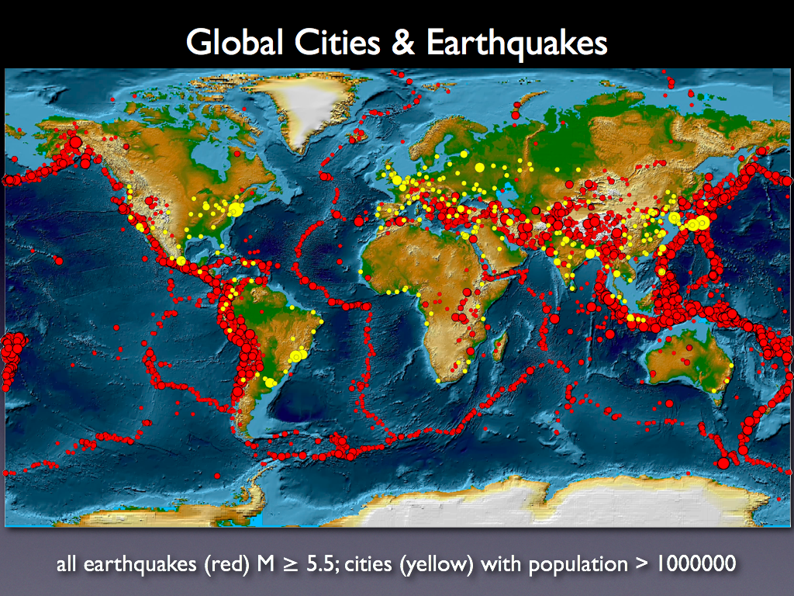

<div align="center">

</div>

> <p dir="RTL"> 
با استفاده از داده های زلزله ها در ایران و جهان به سوالات زیر پاسخ دهید.
</p>

***

<p dir="RTL">
۱. با استفاده از داده های
historical_web_data_26112015.rds 
و استفاده از نمودار پراکنش سه بعدی بسته plotly نمودار طول، عرض و عمق زلزله ها را رسم نمایید. علاوه بر آن بزرگی هر نقطه را برابر بزرگی زمین لرزه قرار دهید.
</p>


```{r q1, echo=FALSE,message=FALSE, warning=FALSE}
library(readr)
library(plotly)

data = read_rds("~/Downloads/week_11/week_11/data/historical_web_data_26112015.rds")


p <- plot_ly(data, x = ~Latitude, y = ~Longitude, z = ~Depth, size = ~Magnitude, colors = c('#BF382A', '#0C4B8E')) %>%
  add_markers() %>%
  layout(scene = list(yaxis = list(title = 'Latitude'),
                      xaxis = list(title = 'Longitude'),
                      zaxis = list(title = 'Depth')))

p
```

***

<p dir="RTL">
۲. پویانمایی سونامی های تاریخی را بر حسب شدت بر روی نقشه زمین رسم نمایید.(از داده زلزله های بزرگ استفاده نمایید.)
</p>


```{r q2, echo=FALSE,message=FALSE, warning=FALSE}
library(readr)
library(dplyr)
library(ggplot2)
library(maps)
library(ggmap)
library(highcharter)
library(ggthemes)
library(gganimate)


data = read.delim("~/Downloads/week_11/week_11/data/disaster.txt", sep = "\t", dec = ".")

data %>% filter(FLAG_TSUNAMI == "Tsu") %>% 
  rename(lat = LATITUDE,lon = LONGITUDE, z = EQ_MAG_MS,name = COUNTRY,year = YEAR) %>% 
  select(lat, lon, z, name, year) -> dis 

ggplot() +
  borders("world", colour = "gray85", fill = "gray80") +
  theme_map() +
  geom_point(aes(x = lon, y = lat),
             data = dis, colour = 'purple', alpha = .5) +
  labs(title = 'Year: {frame_time}') +
  transition_time(year) +
  ease_aes('linear')

```

***

<p dir="RTL">
۳. نمودار چگالی دو بعدی زلزله های تاریخی ایران را رسم کنید.( از داده iran_earthquake.rds و لایه stat_density_2d استفاده نمایید).

زلزله های بزرگتر از ۵ ریشتر فقط نمایش داده شده اند.
</p>

```{r q3, echo=FALSE,message=FALSE, warning=FALSE}
library(readr)
library(ggplot2)

data = read_rds("~/Downloads/week_11/week_11/data/iran_earthquake.rds")

dr = data %>% filter(Mag > 5)
myMap <- get_map(location = "Iran", zoom = 4)

ggmap(myMap)+
  geom_point(data = dr, aes(x=Long, y = Lat))  + stat_density_2d(data = dr, aes(x = Long , y = Lat)) 

```

***

<p dir="RTL">
۴. احتمال اینکه در ایران در پنج سال آینده زلزله به بزرگی هفت ریشتر رخ دهد را محاسبه کنید. (از احتمال شرطی استفاده کنید.)

به دلیل ناقص بودن داده های زلزله های ۷ ریشتری، داده ها از ویکیپدیا استخراج شد.
</p>


```{r q4,message=FALSE, warning=FALSE}
library(readr)
library(ggplot2)


#d = data %>% select(OriginTime, Mag) 
#d %>% filter(Mag >= 7) %>% mutate(year = substr(OriginTime, 1,4)) -> d


#d %>% mutate(lastyear = 2) -> d

#for (i in 1:(nrow(d) - 1)){
#  x = d[i,]
#  y = d[i + 1, ]
#  x$lastyear = as.integer(x$year) - as.integer(y$year)
#  d[i,] = x
#}


year = c(856,2013, 1721, 1042, 1990, 1978, 1968, 2017, 1997, 1909, 1947, 1929, 1930, 1981, 1962, 1957, 1957)
year = sort(year)
last = list()
for (i in 1:(length(year) - 1)){
  last[i] = year[i+1] - year[i] 
}

# A|B = AB / B B = > 1 A = < 6
ab = 0
b = 0
for (i in 1:(length(last))){
  x = last[i]
  if(x >= 1)
    b = b + 1
  if ((x >= 1) && (x <= 6))
    ab = ab + 1
}

print(ab/b)
```

***

<p dir="RTL">
۵. بر اساس داده های زلزله های بزرگ ابتدا تعداد و متوسط کشته زلزله ها را بر حسب کشور استخراج نمایید. سپس نمودار گرمایی تعداد کشته ها را بر روی کره زمین رسم نمایید.(مانند مثال زیر!)
</p>

<div align="center">

</div>


<p dir="RTL">
متوسط تعداد کشته ها
</p>

```{r q51, echo=FALSE,message=FALSE, warning=FALSE}
library(readr)
library(dplyr)
library(ggplot2)
library(maps)
library(ggmap)
library(highcharter)
library(tools)

data = read.delim("~/Downloads/week_11/week_11/data/disaster.txt", sep = "\t", dec = ".")


data = data %>% select(LATITUDE, LONGITUDE, COUNTRY, DEATHS) 
death =data %>% group_by(COUNTRY) %>% summarise(ave = mean(DEATHS, na.rm = TRUE))

death %>% 
  rename(region = COUNTRY) -> death 


world <- map_data("world")

death$region = tolower(death$region)
world$region = tolower(world$region)

world = full_join(world, death)

ggplot() +
  geom_polygon(data=world, aes(x=long, y=lat, group = group, fill=ave),colour="white") +
  scale_fill_continuous(low = "thistle2", high = "darkred", guide="colorbar") +
  labs(fill = "Deaths", title = "Deaths in World", x="", y="") +
  theme(legend.position = "top") +
  theme_bw() +
  scale_y_continuous(breaks=c()) + 
  scale_x_continuous(breaks=c()) + 
  theme(panel.border =  element_blank()) +
  theme(legend.position = "top")
```

<p dir="RTL">
کل تعداد کشته ها
</p>

```{r q52, echo=FALSE,message=FALSE, warning=FALSE}
library(readr)
library(dplyr)
library(ggplot2)
library(maps)
library(ggmap)
library(highcharter)
library(tools)

data = read.delim("~/Downloads/week_11/week_11/data/disaster.txt", sep = "\t", dec = ".")


data = data %>% select(LATITUDE, LONGITUDE, COUNTRY, DEATHS) 
death =data %>% group_by(COUNTRY) %>% summarise(tot = sum(DEATHS, na.rm = TRUE))

death %>% 
  rename(region = COUNTRY) -> death 


world <- map_data("world")

death$region = tolower(death$region)
world$region = tolower(world$region)

world = full_join(world, death)

ggplot() +
  geom_polygon(data=world, aes(x=long, y=lat, group = group, fill=tot),colour="white") +
  scale_fill_continuous(low = "thistle2", high = "darkred", guide="colorbar") +
  labs(fill = "Deaths", title = "Deaths in World", x="", y="") +
  theme(legend.position = "top") +
  theme_bw() +
  scale_y_continuous(breaks=c()) + 
  scale_x_continuous(breaks=c()) + 
  theme(panel.border =  element_blank()) +
  theme(legend.position = "top")
```

***

<p dir="RTL">
۶. با استفاده از داده لرزه های بزرگ و به وسیله طول، عرض، شدت، عمق مدلی برای پیش بینی تعداد کشته های زلزله بیابید.
</p>


```{r q6,message=FALSE, warning=FALSE}
library(readr)
library(dplyr)
library(ggplot2)
library(maps)
library(ggmap)


data = read.delim("~/Downloads/week_11/week_11/data/disaster.txt", sep = "\t", dec = ".")
data = data %>% select(lat = LATITUDE, long = LONGITUDE, country = COUNTRY, deaths = DEATHS, depth = FOCAL_DEPTH, mag = EQ_MAG_MS) 
data = na.omit(data)

fit = lm( deaths ~ lat + long + depth + mag, data = data)
summary(fit)
fit


```

***

<p dir="RTL">
۷. با استفاده از داده worldwide.csv به چند سوال زیر پاسخ دهید. تحقیق کنید آیا می توان از پیش لرزه، زلزله اصلی را پیش بینی کرد؟

زلزلههای بیشتر از ۵ را در نظر گرفتیم و زلزلههایی که در نزدیکی آنها و حداکثر ۲ ساعت قبل و کمتر از ۴ ریشتر بودند را  پیش لرزه آنها. سپس برای هر زلزله میانگین پیش لرزهها محاسبه شد و از تست فرض کورلیشن برای بررسی رابطه این دو استفاده شد. پی ولیو زیاد است بنابراین نمیتوان گفت که بین بزرگی پیش لرزه و بزرگی زلزله رابطه ای برقرار است. حال تست فرضی بین بزرگی زلزله و تعداد پیش لرزه انجام شد و بین آنها طبق پی ولیو رابطه ای وجود دارد. پس میتوان گفت هرچه تعداد پیش لرزه بیشتر احتمال بزرگ بودن زلزله نیز بیشتر است.
</p>


```{r q7, echo=FALSE,message=FALSE, warning=FALSE}
library(readr)

#data = read_rds("~/Downloads/week_11/week_11/data/iran_earthquake.rds")
#data %>% select(OriginTime, Mag, Long, Lat) -> d
#d %>% mutate(Lo = round(Long), La = round(Lat)) -> d


#pish = data.frame(0, 0, 0)
#siz = 0

#d = d[order(d$OriginTime),]
#d %>% select(OriginTime, La, Lo, Mag) ->d


#for (i in 3:(nrow(d))){
#  x = d[i,]
#  st = max(1, i-10)
#  for (j in (i-1):st){
#    y = d[j,]
#    if(((x$La) == (y$La)) & ((x$Lo) == (y$Lo))){
#      t = x$OriginTime - y$OriginTime
#      if(t < 120){
#        if((y$Mag < 4) && (x$Mag > 5)){
#         siz = siz+1
#          pish[siz, ] = c(i, x$Mag, y$Mag) 
#       }
#      }
#      
#    }
#  }
#}

#colnames(pish) = c("id", "main", "pre")
#write_csv(pish, "~/Desktop/Data Analysis/pish.csv")
pish = read_csv("~/Desktop/Data Analysis/pish.csv")
pish %>% group_by(id, main) %>% summarise(avg = mean(pre), cnt = n()) -> avg

cor.test(avg$main, avg$avg)
cor.test(avg$main, avg$cnt)
```

***

<p dir="RTL">
۸. گزاره " آیا شدت زلزله به عمق آن بستگی دارد" را تحقیق کنید؟ (طبیعتا از آزمون فرض باید استفاده کنید.)
</p>


```{r q8,message=FALSE, warning=FALSE}
library(readr)

data = read_csv("~/Downloads/week_11/week_11/data/worldwide.csv")

cor.test(data$mag, data$depth)
```

***

<p dir="RTL"> 
۹. میانگین سالانه زلزله ها را بر حسب کشور به دست آورید. آیا میتوان دلیلی در تایید یا رد تئوری هارپ ارائه کرد.


طبق کد زیر، میانگین سالانه زلزله کشورها محاسبه شده و به ازای هر کشور روی میانگین سالانه آن کشور در سالهای مختلف تست فرض استفاده شده و از آن جایی که هیچ فرض ۰ ای در هیج کشوری رد نشده، بنابراین میانگین هر کشور تغییر محسوسی نکرده پس هارپ بی معنی است.
</p>


```{r q9,message=FALSE, warning=FALSE}
library(readr)

#x = read_csv("~/Downloads/week_11/week_11/data/worldwide.csv")

#x %>% select(mag, time, place) -> x
#x %>% mutate(country = "", year = 0) -> x

#for (i in 1:nrow(x)){
#  t = x[i,]
#  s = t$place
#  s = strsplit(s, ",\\s")
#  s = s[[length(s)]]
#  s = s[[length(s)]]
#  t$country = s
#  x[i,] = t
  
#  t = x[i,]
#  s = t$time
#  s = substring(s, 1, 4)
#  t$year = s
  
#  x[i,] = t
  
  
  
#}

#x %>% select(mag, year, country) -> x 
#x %>% group_by(year,country) %>% summarise(average = mean(mag)) -> ave
#View(ave)
#write_csv(ave, "~/Desktop/Data Analysis/conavge.csv")
ave = read_csv("~/Desktop/Data Analysis/conavge.csv")

countries = unique(ave$country)

p = list()
for (i in 1:(length(countries))){
  t = countries[i]
  
  ave %>% filter(country == t) -> s
  if(nrow(s) == 1){
    p[[i]] = 1
  }
  else{
    z = chisq.test(s$average)
    p[[i]] = z$p.value
  }
  if(p[[i]] < 0.1)
    print(t)
}
```

***

<p dir="RTL"> 
۱۰. سه حقیقت جالب در مورد زلزله بیابید.

زلزله سالیانه ۸۰۰۰ آدم را میکشد و در ۴۰۰۰ سال گذشته ۱۳ میلیون نفر را کشته است.

در نیم کره شمالی زمین تعداد زلزله بیشتری نسبت به نیم کره جنوبی رخ میدهد.

طولانی ترین زلزله ۲۰۰۴ در اقیانوس هند بوده که ۱۰ دقیقه طول کشیده است.

سالیانه ۱۳۰۰۰۰۰ زلزله رخ میدهد که زیر ۳ ریشتر اند.
</p>

