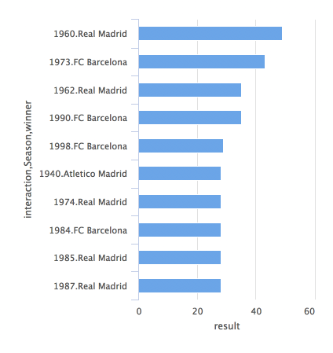
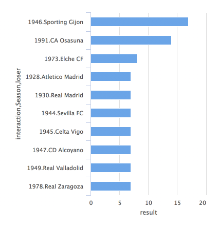

<div align="center">

</div>

<h1 dir="RTL"> 
تمرین سری سوم: از لالیگا تا لیگ برتر
</h1>

> <p dir="RTL"> 
با استفاده از داده های لیگ دسته اول اسپانیا به سوالات زیر پاسخ دهید.
از هر دو ابزار
ggplot2
و
highcharter
برای این کار تصویرسازی استفاده نمایید.
</p>

***

<p dir="RTL">
۱. تعداد قهرمانی های تیم ها در تاریخ لالیگا  را استخراج کرده و نمودار ستونی آنها را رسم کنید.
</p>

<p dir="RTL">
در کل تمرین معیار رتبه بندی تیم ها امتیاز، تفاضل گل و گل زده است.
</p>
```{r q1, echo=FALSE,warning=FALSE, comment=FALSE,message=FALSE}
library(devtools)
library(engsoccerdata)
library(dplyr)
library(highcharter)
library(ggplot2)


fdb = as.tbl(spain)
fdb = arrange(fdb, Date)

fdb %>% group_by(Season, team = home) %>% summarise(w1 = sum(hgoal > vgoal), dr1 = sum(hgoal == vgoal), g1 = sum(hgoal), t1 = sum(vgoal)) -> d1
fdb %>% group_by(Season, team = visitor) %>% summarise(w2 = sum(vgoal > hgoal), dr2 = sum(hgoal == vgoal), g2 = sum(vgoal), t2 = sum(hgoal)) -> d2

d3 = full_join(d1,d2)
d3 %>% mutate(wins = w1 + w2, draws = dr1 + dr2, goals = g1 + g2, opgoals = t1 + t2) -> d3

d3 %>% mutate(diff = goals - opgoals) -> d3
d3 %>% mutate(score = 3 * wins + draws) -> d3

d3 = arrange(d3, -score,-diff, -goals, Season)

d3 %>% group_by(Season) %>% slice(which.max(score)) -> d4

d4 %>% group_by(team) %>% summarise(num = sum(Season > 0)) ->d5

ggplot(data = d5, aes(x = team, y = num)) + geom_col(fill = "purple") + theme(axis.text.x = element_text(angle=-90, vjust=0.5))

d5 %>% hchart(type = "bar", hcaes(x = team , y = num), name = "number of wins")

```


***


<p dir="RTL">
۲. کسل کننده ترین لیگ و تیم را بیابید.
نمودار ده تیم و ده فصل کسل کننده را رسم کنید.
</p>


<p dir="RTL">
مبنای کسل کنندگی تیم تعداد بازیهایی است که در آن گل نزده و تعداد بازیهایی که در آن ۰-۰ بازی کرده است.
در یک فصل کسل کنندگی به تعداد بازیهای ۰-۰ و تعداد مساوی ها بستگی دارد.
</p>

```{r q2, echo=FALSE,warning=FALSE, comment=FALSE,message=FALSE}
library(devtools)
library(engsoccerdata)
library(dplyr)
library(highcharter)
library(ggplot2)


fdb = as.tbl(spain)
fdb = arrange(fdb, Date)

fdb %>% group_by(team = home) %>% summarise(dr1 = sum(hgoal == vgoal), z1 = sum(hgoal == 0), dz1 = sum(hgoal == 0 & vgoal == 0)) -> d1
fdb %>% group_by(team = visitor) %>% summarise( dr2 = sum(hgoal == vgoal),z2 = sum(vgoal == 0), dz2 = sum(hgoal == 0 & vgoal == 0)) -> d2


d3 = full_join(d1,d2)

d3 %>% mutate(draws = dr1 + dr2, zerodraws = dz1 + dz2 , zerogames = z1 + z2) -> d3

d3 %>% mutate(score = zerodraws + 2 * zerogames) -> d3
d3 = arrange(d3, -score)
d3 = head(d3, 10)

ggplot(data = d3, aes(x = team, y = score)) + geom_col(fill = "purple")


d3 %>% hchart(type = "bar", hcaes(x = team , y = score), name = "boringness")


#season

fdb %>% group_by(Season) %>% summarise(goals = sum(hgoal + vgoal), draws = sum(hgoal == vgoal), zdraws = sum(hgoal == vgoal & hgoal == 0)) -> d7
d7 %>% mutate(score = zdraws * 2 + draws ) -> d7
d7= arrange(d7, -score, goals)
d7 = head(d7, 10)

ggplot(data = d7, aes(x = Season, y = score)) + geom_col(fill = "purple")


d7 %>% hchart(type = "bar", hcaes(x = Season , y = score), name = "boringness")

```


***

<p dir="RTL">
۳. در چند درصد موارد قهرمان نیم فصل در پایان فصل قهرمان شده است؟
</p>

```{r q3, echo=FALSE,warning=FALSE, comment=FALSE,message=FALSE}
library(devtools)
library(engsoccerdata)
library(dplyr)
library(highcharter)
library(ggplot2)

fdb = as.tbl(spain)

fdb = arrange(fdb, Date)

fdb %>% select(name = home) %>% unique() -> teams

fdb %>% group_by(Season) %>% summarise(count = n()) -> seas

seas %>% mutate(half = "Empty", total = "empty") -> seas

teams %>% mutate(score = 0, goals = 0, diff = 0) -> teams


prev = 0
c = 0

for (i in 1:nrow(fdb)){
  x = fdb[i,]
  now = x$Season
  if(now != prev){
    c = 0
    teams$score = 0
    teams$goals = 0
    teams$diff = 0
  }
  prev = now
  
  homescore = teams$score[teams$name == x$home]
  visitorscore = teams$score[teams$name == x$visitor]
  
  homegoals = teams$goals[teams$name == x$home]
  visitorgoals = teams$goals[teams$name == x$visitor]
  
  homediff = teams$diff[teams$name == x$home]
  visitordiff = teams$diff[teams$name == x$visitor]
  
  if(x$hgoal == x$vgoal){
    teams$score[teams$name == x$home] = homescore + 1
    teams$score[teams$name == x$visitor] = visitorscore + 1
    
  }
  else if(x$hgoal > x$vgoal)
    teams$score[teams$name == x$home] = homescore + 3
  else
    teams$score[teams$name == x$visitor] = visitorscore + 3
  
  
  
  teams$goals[teams$name == x$home] = homegoals + x$hgoal
  teams$goals[teams$name == x$visitor] = visitorgoals + x$vgoal
  
  
  teams$diff[teams$name == x$home] = homediff + x$hgoal - x$vgoal
  teams$diff[teams$name == x$visitor] = visitordiff + x$vgoal - x$hgoal
  
  c = c+1
  tot = seas$count[seas$Season == x$Season]
  if(c * 2 == tot){
    teams = arrange(teams, -score, -diff, -goals)
    halfw = head(teams, 1)
    seas$half[seas$Season == x$Season] = halfw$name
  }
  else if(c == tot){
    
    teams = arrange(teams, -score, -diff, -goals)
    totw = head(teams, 1)
    seas$total[seas$Season == x$Season] = totw$name
  }
}

seas %>% summarise(both = sum(half == total), tot = n()) -> final
final %>% mutate(rate = 100 * both/ tot)

```

***

<p dir="RTL">
۴. در بین سال های ۲۰۰۱ تا ۲۰۱۰ گربه سیاه تیم های بزرگ چه تیم هایی بوده است؟
</p>

<p dir="RTL">
نمودار ۴ گربه سیاه برتر ۳ تیم قوی لالیگا
</p>
```{r q4, echo=FALSE,warning=FALSE, comment=FALSE,message=FALSE}
library(devtools)
library(engsoccerdata)
library(dplyr)
library(highcharter)
library(ggplot2)


fdb = as.tbl(spain)
fdb = arrange(fdb, Date)

fdb %>% filter(Season > 2000 & Season <= 2010) -> d
d %>% filter(home == "Real Madrid" | home == "FC Barcelona" | home == "Atletico Madrid" | visitor == "Real Madrid" | visitor == "FC Barcelona" | visitor == "Atletico Madrid") -> d
d %>% filter(home == "Real Madrid") -> dreal1
d %>% filter(visitor == "Real Madrid") -> dreal2

dreal1 %>% group_by(team = visitor) %>% summarise(wins1 = sum(vgoal > hgoal), tot1 = n()) -> dreal1
dreal2 %>% group_by(team = home) %>% summarise(wins2 = sum(vgoal > hgoal), tot2 = n()) -> dreal2

dreal = full_join(dreal1, dreal2)
dreal %>% mutate(wins = wins1 + wins2, tot = tot1 + tot2) -> dreal
dreal %>% filter(team != "FC Barcelona" & team != "Atletico Madrid") -> dreal
dreal = arrange(dreal , -wins)
dreal = head(dreal , 4)

ggplot(dreal , aes(x = team , y = wins)) + geom_col(fill = "purple" , alpha = 0.6) + theme(axis.text.x = element_text(angle=-90, vjust=0.5)) + xlab("Real Madrid")


d %>% filter(home == "FC Barcelona") -> dbarca1
d %>% filter(visitor == "FC Barcelona") -> dbarca2

dbarca1 %>% group_by(team = visitor) %>% summarise(wins1 = sum(vgoal > hgoal), tot1 = n()) -> dbarca1
dbarca2 %>% group_by(team = home) %>% summarise(wins2 = sum(vgoal > hgoal), tot2 = n()) -> dbarca2

dbarca = full_join(dbarca1, dbarca2)
dbarca %>% mutate(wins = wins1 + wins2, tot = tot1 + tot2) -> dbarca
dbarca %>% filter(team != "Real Madrid" & team != "Atletico Madrid") -> dbarca
dbarca = arrange(dbarca , -wins)
dbarca = head(dbarca , 4)

ggplot(dbarca , aes(x = team , y = wins)) + geom_col(fill = "purple" , alpha = 0.6) + theme(axis.text.x = element_text(angle=-90, vjust=0.5)) + xlab("FC Barcelona")


d %>% filter(home == "Atletico Madrid") -> dmad1
d %>% filter(visitor == "Atletico Madrid") -> dmad2

dmad1 %>% group_by(team = visitor) %>% summarise(wins1 = sum(vgoal > hgoal), tot1 = n()) -> dmad1
dmad2 %>% group_by(team = home) %>% summarise(wins2 = sum(vgoal > hgoal), tot2 = n()) ->dmad2

dmad= full_join(dmad1, dmad2)
dmad %>% mutate(wins = wins1 + wins2, tot = tot1 + tot2) -> dmad
dmad %>% filter(team != "Real Madrid" & team != "FC Barcelona") -> dmad
dmad = arrange(dmad , -wins)
dmad= head(dmad , 4)

ggplot(dmad , aes(x = team , y = wins)) + geom_col(fill = "purple" , alpha = 0.6) + theme(axis.text.x = element_text(angle=-90, vjust=0.5)) + xlab("Atletico Madrid")

```

***

<p dir="RTL">
۵. در تاریخ لالیگا کدام تیم رکورددار زودترین قهرمانی است؟
همچنین کدام تیم مقتدرانه ترین قهرمانی را داشته است؟
</p>

<p dir="RTL">
زودترین قهرمانی (بر اساس فاصله از روز آخر بازیها)
</p>

<div align="center">

</div>

```{r q51, eval = FALSE, warning=FALSE, comment=FALSE,echo=FALSE,message=FALSE}
library(devtools)
library(engsoccerdata)
library(dplyr)
library(highcharter)
library(ggplot2)


fdb = as.tbl(spain)
fdb = arrange(fdb, Date)
fdb %>% group_by(Season) %>% summarise(end = max(Date), result = 0, winner = "empty") -> seas

View(seas)
fdb %>% group_by(Season, name = home) %>% summarise(c1 = n()) -> d1
fdb %>% group_by(Season, name = visitor) %>% summarise(c2 = n()) -> d2
d3 = full_join(d1, d2)
d3 %>% mutate(count = c1 + c2) -> teams
teams %>% select(Season, name , count) -> teams
teams %>% mutate(score = 0 , future = 0) -> teams
View(teams)

for (i in 1:nrow(fdb)){

  x = fdb[i,]

  
  homescore = teams$score[x$Season == teams$Season & teams$name == x$home]
  visitorscore = teams$score[x$Season == teams$Season & teams$name == x$visitor]

  
  if(x$hgoal == x$vgoal){
    teams$score[x$Season == teams$Season & teams$name == x$home] = homescore + 1
    teams$score[x$Season == teams$Season & teams$name == x$visitor] = visitorscore + 1
    
  }
  else if(x$hgoal > x$vgoal)
    teams$score[x$Season == teams$Season & teams$name == x$home] = homescore + 3
  else
    teams$score[x$Season == teams$Season & teams$name == x$visitor] = visitorscore + 3
  
  teams$count[teams$Season == x$Season & teams$name == x$home] = teams$count[teams$Season == x$Season & teams$name == x$home] - 1
  teams$count[teams$Season == x$Season & teams$name == x$visitor] = teams$count[teams$Season == x$Season & teams$name == x$visitor] - 1


  
  teams %>% filter(Season == x$Season) -> t0
  t0 = arrange(t0 , -score)
  q = t0[1,]
  w = t0[2,]
  ss = w$score + teams$count[teams$Season == x$Season & teams$name == w$name] * 3
  if(ss < q$score){
    seas$result[seas$Season == x$Season] = max(seas$result[seas$Season == x$Season],seas$end[seas$Season == x$Season] - x$Date)
    seas$winner[seas$Season == x$Season] = q$name
  }
  print(x$Season)
}

View(seas)

seas = arrange(seas, -result)
seas = head(seas, 10)

seas %>% hchart("bar", hcaes(x = interaction(Season, winner), y = result), name = "days remaining")
```
<p dir="RTL">
مقتدرانه ترین بردها:
</p>

```{r q52, echo=FALSE,warning=FALSE, comment=FALSE,message=FALSE}
library(devtools)
library(engsoccerdata)
library(dplyr)
library(highcharter)
library(ggplot2)


fdb = as.tbl(spain)
fdb = arrange(fdb, Date)

fdb %>% group_by(Season, team = home) %>% summarise(w1 = sum(hgoal > vgoal), dr1 = sum(hgoal == vgoal), g1 = sum(hgoal), t1 = sum(vgoal)) -> d1
fdb %>% group_by(Season, team = visitor) %>% summarise(w2 = sum(vgoal > hgoal), dr2 = sum(hgoal == vgoal), g2 = sum(vgoal), t2 = sum(hgoal)) -> d2


d3 = full_join(d1,d2)

d3 %>% mutate(wins = w1 + w2, draws = dr1 + dr2, goals = g1 + g2, opgoals = t1 + t2) -> d3

d3 %>% mutate(diff = goals - opgoals) -> d3
d3 %>% mutate(score = 3 * wins + draws) -> d3

d3 = arrange(d3, -score,-diff, -goals, Season)


d3 %>% group_by(Season) %>% slice(which.max(score)) -> d4
d3 %>% mutate(diffwithone = 0) ->d3


for (i in 1:nrow(d3)){
  x = d3[i,]
  name =  d4$team[d4$Season == x$Season]
  score =  d4$score[d4$Season == x$Season]
  
  if(x$team == name)
    d3$diffwithone[d3$Season == x$Season & d3$team == x$team] = -1
  else
    d3$diffwithone[d3$Season == x$Season & d3$team == x$team] = score - x$score
  
}

d3 %>% filter(diffwithone > -1) -> d5
d5 %>% group_by(Season) %>% slice(which.min(diffwithone)) -> d5
d5 = arrange(d5, -diffwithone)
d5 %>% select(Season, second = team, diff = diffwithone) -> d5
d4 %>% select(Season, first = team) -> d4
d6 = full_join(d4, d5)

d6 = arrange(d6 , -diff)
d6 = head(d6, 10)

ggplot(d6, aes(x = interaction(Season, first), y = diff)) + geom_col(fill = "purple" , alpha = 0.5) +theme(axis.text.x = element_text(angle=-90, vjust=0.5)) 
d6 %>% hchart(type = "bar", hcaes(x = interaction(Season, first), y = diff), name = "difference with second")


```

***

<p dir="RTL">
۶. طولانی ترین نوار پیروزی مساوی و شکست مال چه تیم هایی است؟
</p>
```{r q6, echo=FALSE,warning=FALSE, comment=FALSE,message=FALSE}
library(devtools)
library(engsoccerdata)
library(dplyr)
library(highcharter)
library(ggplot2)

fdb = as.tbl(spain)
fdb = arrange(fdb, Date)

fdb %>% select(name = home) %>% unique()-> teams
teams %>% mutate(maxWin = 0 , maxLose = 0 , nowWin = 0 , nowLose = 0, nowDraw = 0 , maxDraw = 0) -> teams

for (i in 1:nrow(fdb)) {
  x = fdb[i,]
  home = x$home
  visitor = x$visitor
  
  teams$maxWin[teams$name == home] = max(teams$maxWin[teams$name == home], teams$nowWin[teams$name == home])
  teams$maxWin[teams$name == visitor] = max(teams$maxWin[teams$name == visitor], teams$nowWin[teams$name == visitor])
  
  teams$maxLose[teams$name == visitor] = max(teams$maxLose[teams$name == visitor], teams$nowLose[teams$name == visitor])
  teams$maxLose[teams$name == home] = max(teams$maxLose[teams$name == home], teams$nowLose[teams$name == home])
  
  teams$maxDraw[teams$name == visitor] = max(teams$maxDraw[teams$name == visitor], teams$nowDraw[teams$name == visitor])
  teams$maxDraw[teams$name == home] = max(teams$maxDraw[teams$name == home], teams$nowDraw[teams$name == home])
  
  
  if(x$hgoal > x$vgoal){
    teams$nowWin[teams$name == home] = teams$nowWin[teams$name == home] + 1
    teams$nowLose[teams$name == home] = 0
    
    
    teams$nowLose[teams$name == visitor] = teams$nowLose[teams$name == visitor] + 1
    teams$nowWin[teams$name == visitor] = 0
    
    
    teams$nowDraw[teams$name == visitor] = 0
    teams$nowDraw[teams$name == home] = 0
    
    
  }
  else if(x$hgoal < x$vgoal){
    teams$nowWin[teams$name == visitor] = teams$nowWin[teams$name == visitor] + 1
    teams$nowLose[teams$name == visitor] = 0
    
    teams$nowLose[teams$name == home] = teams$nowLose[teams$name == home] + 1
    teams$nowWin[teams$name == home] = 0
    
    
    teams$nowDraw[teams$name == visitor] = 0
    teams$nowDraw[teams$name == home] = 0
    
  }
  else{
    teams$nowWin[teams$name == home] = 0
    teams$nowWin[teams$name == visitor] = 0
   
    teams$nowLose[teams$name == visitor] = 0
    teams$nowLose[teams$name == home] = 0
    
    
    teams$nowDraw[teams$name == visitor] = teams$nowDraw[teams$name == visitor] + 1
    teams$nowDraw[teams$name == home] = teams$nowDraw[teams$name == home] + 1
    
  }
  
  teams$maxWin[teams$name == home] = max(teams$maxWin[teams$name == home], teams$nowWin[teams$name == home])
  teams$maxWin[teams$name == visitor] = max(teams$maxWin[teams$name == visitor], teams$nowWin[teams$name == visitor])
  
  teams$maxLose[teams$name == visitor] = max(teams$maxLose[teams$name == visitor], teams$nowLose[teams$name == visitor])
  teams$maxLose[teams$name == home] = max(teams$maxLose[teams$name == home], teams$nowLose[teams$name == home])

  
}


maxwins = arrange(teams, -maxWin)
maxwins = head(maxwins, 5)
maxloses = arrange(teams, -maxLose)
maxloses = head(maxloses , 5)
maxdraws = arrange(teams, -maxDraw)
maxdraws = head(maxdraws , 5)


maxwins %>% hchart(type = "bar", hcaes(x = name , y = maxWin), name = "number of wins")
maxloses %>% hchart(type = "bar", hcaes(x = name , y = maxLose), name = "number of loses")
maxdraws %>% hchart(type = "bar", hcaes(x = name , y = maxDraw), name = "number of draws")


```

***

<p dir="RTL">
۷. زودترین سقوط مال کدام تیم بوده است؟
</p>


<p dir="RTL">
زودترین سقوط (بر اساس فاصله از روز آخر بازیها)
</p>


<div align="center">

</div>

```{r q7, eval = FALSE, echo=FALSE,warning=FALSE, comment=FALSE,message=FALSE}
library(devtools)
library(engsoccerdata)
library(dplyr)
library(highcharter)
library(ggplot2)


fdb = as.tbl(spain)
fdb = arrange(fdb, Date)
fdb %>% group_by(Season) %>% summarise(end = max(Date), result = 0, loser = "empty") -> seas

fdb %>% group_by(Season, name = home) %>% summarise(c1 = n()) -> d1
fdb %>% group_by(Season, name = visitor) %>% summarise(c2 = n()) -> d2
d3 = full_join(d1, d2)
d3 %>% mutate(count = c1 + c2) -> teams
teams %>% select(Season, name , count) -> teams
teams %>% mutate(score = 0 , future = 0) -> teams


for (i in 1:nrow(fdb)){
  
  x = fdb[i,]
  
  
  homescore = teams$score[x$Season == teams$Season & teams$name == x$home]
  visitorscore = teams$score[x$Season == teams$Season & teams$name == x$visitor]
  
  
  if(x$hgoal == x$vgoal){
    teams$score[x$Season == teams$Season & teams$name == x$home] = homescore + 1
    teams$score[x$Season == teams$Season & teams$name == x$visitor] = visitorscore + 1
    
  }
  else if(x$hgoal > x$vgoal)
    teams$score[x$Season == teams$Season & teams$name == x$home] = homescore + 3
  else
    teams$score[x$Season == teams$Season & teams$name == x$visitor] = visitorscore + 3
  
  teams$count[teams$Season == x$Season & teams$name == x$home] = teams$count[teams$Season == x$Season & teams$name == x$home] - 1
  teams$count[teams$Season == x$Season & teams$name == x$visitor] = teams$count[teams$Season == x$Season & teams$name == x$visitor] - 1
  
  
  
  teams %>% filter(Season == x$Season) -> t0
  t0 = arrange(t0 , -score)
  l = tail(t0, 5)
  q = l[1,]
  w = l[2,]
  ss = w$score + teams$count[teams$Season == x$Season & teams$name == w$name] * 3
  if(ss < q$score){
    seas$result[seas$Season == x$Season] = max(seas$result[seas$Season == x$Season],seas$end[seas$Season == x$Season] - x$Date)
    seas$loser[seas$Season == x$Season] = q$name
  }
  print(x$Season)
}

View(seas)

seas = arrange(seas, -result)
seas = head(seas, 10)

seas %>% hchart("bar", hcaes(x = interaction(Season, loser), y = result), name = "days remaining")
```

***

<div align="center">

</div>

<p dir="RTL">
مانند شکل بالا تصویری از روند تغییر رتبه تیم ها در طول فصل ۱۹۹۸ رسم نمایید.
</p>


```{r q8, echo=FALSE,warning=FALSE, comment=FALSE,message=FALSE}
library(devtools)
library(engsoccerdata)
library(dplyr)
library(highcharter)
library(ggplot2)

fdb = as.tbl(spain)
fdb = arrange(fdb, Date)
fdb %>% mutate(day = substr(Date, 6, 10)) -> games
games %>% filter(Season == 1998) -> games


games %>% select(name = home) %>% unique() -> teams
games %>% select(Date) %>% unique()-> dates

dates = merge(dates, teams)
dates %>% mutate(rank = 0) -> dates

teams %>% mutate(score = 0 , goals = 0 , diff = 0) -> teams

for (i in 1:nrow(games)){
  x = games[i,]
  homescore = teams$score[teams$name == x$home]
  visitorscore = teams$score[teams$name == x$visitor]
  
  homegoals = teams$goals[teams$name == x$home]
  visitorgoals = teams$goals[teams$name == x$visitor]
  
  homediff = teams$diff[teams$name == x$home]
  visitordiff = teams$diff[teams$name == x$visitor]
  
  if(x$hgoal == x$vgoal){
    teams$score[teams$name == x$home] = homescore + 1
    teams$score[teams$name == x$visitor] = visitorscore + 1
    
  }
  else if(x$hgoal > x$vgoal)
    teams$score[teams$name == x$home] = homescore + 3
  else
    teams$score[teams$name == x$visitor] = visitorscore + 3
  
  
  
  teams$goals[teams$name == x$home] = homegoals + x$hgoal
  teams$goals[teams$name == x$visitor] = visitorgoals + x$vgoal
  
  
  teams$diff[teams$name == x$home] = homediff + x$hgoal - x$vgoal
  teams$diff[teams$name == x$visitor] = visitordiff + x$vgoal - x$hgoal
  
  
  teams = arrange(teams, -score, -diff , -goals)
  for (j in 1:nrow(teams)){
    y = teams[j,]
    dates$rank[dates$Date == x$Date & dates$name == y$name] = j
  }
}
ggplot(dates, aes(x = Date, y = rank , color = name)) + geom_line()

```

***

<div align="center">

</div>

<p dir="RTL">
۹. جدولی مشابه بالا برای فصل ۲۰۱۲ از  کل نتایج طراحی کنید.
</p>

```{r q9, echo=FALSE,warning=FALSE, comment=FALSE,message=FALSE}
library(devtools)
library(engsoccerdata)
library(dplyr)
library(highcharter)
library(ggplot2)


fdb = as.tbl(spain)

fdb = arrange(fdb, Date)

fdb %>% filter(Season == 2012) -> d

d %>% select(home, visitor, FT) -> d
ggplot(d, aes(home, visitor, fill=FT)) + geom_tile(aes(width=.95, height=.95)) + geom_text(aes(label=FT), size=2) + theme(axis.text.x = element_text(angle=-90, vjust=0.5)) 

```

***

<p dir="RTL">
۱۰. سه آماره به همراه نمودار فردوسی پسند استخراج کنید.
</p>

<p dir="RTL">
بازی کردن در زمین خود چقدر تاثیر دارد؟
برای ۲۰ تیم برتر (تعداد برد بیشتر) نمودار نسبت برد در خانه به برد در زمین حریف را محاسبه کرده ایم.
</p>

```{r q101, echo=FALSE,warning=FALSE, comment=FALSE,message=FALSE}
library(devtools)
library(engsoccerdata)
library(dplyr)
library(highcharter)
library(ggplot2)


fdb = as.tbl(spain)
fdb = arrange(fdb, Date)


fdb %>% group_by(Season, team = home) %>% summarise(w1 = sum(hgoal > vgoal), dr1 = sum(hgoal == vgoal), g1 = sum(hgoal), t1 = sum(vgoal)) -> d1
fdb %>% group_by(Season, team = visitor) %>% summarise(w2 = sum(vgoal > hgoal), dr2 = sum(hgoal == vgoal), g2 = sum(vgoal), t2 = sum(hgoal)) -> d2


d3 = full_join(d1,d2)
d3 %>% group_by(team) %>% summarise(whome = sum(w1), wvisit = sum(w2), gh = sum(g1), gv = sum(g2)) -> d3
d3 %>% mutate(rate = whome / wvisit, grate = gh/gv) -> d3
d3 = arrange(d3, -whome - wvisit)
d3 = head(d3, 20)

ggplot(d3, aes(x = team, y = rate)) + geom_col(fill= "purple") +theme(axis.text.x = element_text(angle=-90, vjust=0.5)) 
```


<p dir="RTL">
دربی الکلاسیکو را در نظر میگیریم. در چند درصد از فصل هایی که یک تیم تمام دربی های الکلاسیکو را برنده میشد این تیم قهرمان فصل میشود؟
</p>

```{r q102, echo=FALSE,warning=FALSE, comment=FALSE,message=FALSE}
library(devtools)
library(engsoccerdata)
library(dplyr)
library(highcharter)
library(ggplot2)

fdb = as.tbl(spain)
fdb = arrange(fdb, Date)

fdb %>% group_by(Season, team = home) %>% summarise(w1 = sum(hgoal > vgoal), dr1 = sum(hgoal == vgoal), g1 = sum(hgoal), t1 = sum(vgoal)) -> d1
fdb %>% group_by(Season, team = visitor) %>% summarise(w2 = sum(vgoal > hgoal), dr2 = sum(hgoal == vgoal), g2 = sum(vgoal), t2 = sum(hgoal)) -> d2


d3 = full_join(d1,d2)

d3 %>% mutate(wins = w1 + w2, draws = dr1 + dr2, goals = g1 + g2, opgoals = t1 + t2) -> d3

d3 %>% mutate(diff = goals - opgoals) -> d3
d3 %>% mutate(score = 3 * wins + draws) -> d3

d3 = arrange(d3, -score,-diff, -goals, Season)

d3 %>% group_by(Season) %>% slice(which.max(score)) -> d4

d4 %>% select(Season, team) -> d4


fdb %>% filter((home == "FC Barcelona" & visitor == "Real Madrid") | (visitor == "FC Barcelona" & home == "Real Madrid")) -> darbi

darbi %>% filter(home == "FC Barcelona") -> hb
darbi %>% filter(home != "FC Barcelona") -> hm

hb %>% group_by(Season) %>% summarise(bcw0 = sum(hgoal > vgoal), rmw0 = sum(hgoal < vgoal), d0 = sum(hgoal == vgoal)) ->hb
hm %>% group_by(Season) %>% summarise(rmw1 = sum(hgoal > vgoal), bcw1 = sum(hgoal < vgoal), d1 = sum(hgoal == vgoal)) ->hm

tot = full_join(hb, hm)
tot %>% mutate(rmw = rmw0 + rmw1, bcw = bcw0 + bcw1, d = d0 + d1)->tot


tot %>% filter(d == 0 & (bcw == 0 | rmw == 0)) -> tot
tot %>% select(Season, bcw, rmw) -> tot
tot %>% mutate(champion = FALSE) -> tot

for (i in 1:nrow(tot)){
  x = tot[i,]
  if(x$bcw > x$rmw){
    ch = d4$team[d4$Season == x$Season]
    if(ch == "FC Barcelona")
      tot$champion[tot$Season == x$Season] = TRUE
  }
  
  if(x$bcw < x$rmw){
    ch = d4$team[d4$Season == x$Season]
    if(ch == "Real Madrid")
      tot$champion[tot$Season == x$Season] = TRUE
  }
}

tot = na.omit(tot)
tot %>% summarise(rate = 100 * sum(champion) / n() )
```


<p dir="RTL">
5 تیم برتر (از نظر تعداد بار قهرمان شدن) را در نظر بگیرید. جدول تعداد بردهای هردو تیم نسبت به هم را رسم کنید.
</p>

```{r q103, echo=FALSE,warning=FALSE, comment=FALSE,message=FALSE}
library(devtools)
library(engsoccerdata)
library(dplyr)
library(highcharter)
library(ggplot2)


fdb = as.tbl(spain)
fdb = arrange(fdb, Date)

fdb %>% group_by(Season, team = home) %>% summarise(w1 = sum(hgoal > vgoal), dr1 = sum(hgoal == vgoal), g1 = sum(hgoal), t1 = sum(vgoal)) -> d1
fdb %>% group_by(Season, team = visitor) %>% summarise(w2 = sum(vgoal > hgoal), dr2 = sum(hgoal == vgoal), g2 = sum(vgoal), t2 = sum(hgoal)) -> d2


d3 = full_join(d1,d2)

d3 %>% mutate(wins = w1 + w2, draws = dr1 + dr2, goals = g1 + g2, opgoals = t1 + t2) -> d3

d3 %>% mutate(diff = goals - opgoals) -> d3
d3 %>% mutate(score = 3 * wins + draws) -> d3

d3 = arrange(d3, -score,-diff, -goals, Season)

d3 %>% group_by(Season) %>% slice(which.max(score)) -> d4

d4 %>% group_by(team) %>% summarise(num = sum(Season > 0)) ->d5


d5 = arrange(d5, -num)
d5 = head(d5, 5)
d5 %>% select(team0 = team) %>% unique() -> teams
teams %>% select(team1 = team0) -> teams1

alls = merge(teams, teams1)

alls %>% mutate(wins = 0) -> alls

for (i in 1:nrow(fdb)){
  x = fdb[i,]
  if(x$hgoal > x$vgoal)
    alls$wins[alls$team0 == x$home & alls$team1 == x$visitor] =   alls$wins[alls$team0 == x$home & alls$team1 == x$visitor] + 1
  
  if(x$hgoal < x$vgoal)
    alls$wins[alls$team0 == x$visitor & alls$team1 == x$home] =   alls$wins[alls$team0 == x$visitor & alls$team1 == x$home] + 1
}
ggplot(alls, aes(team0, team1, fill="red")) + geom_tile(aes(width=.95, height=.95)) + geom_text(aes(label=wins), size=3) + theme(axis.text.x = element_text(angle=-90, vjust=0.5)) 

```