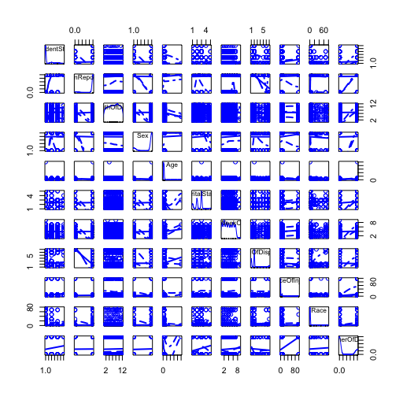
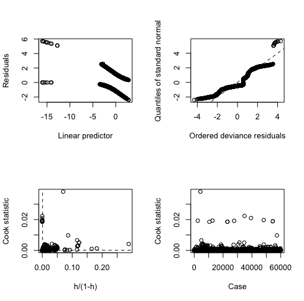

<div align="center">

</div>

> <p dir="RTL"> 
با توجه به سوالات مرگ و میر در آمریکا به سوالات زیر پاسخ دهید.
</p>

***

<p dir="RTL">
۱. از میان متغیرهای داده مرگ و میر یک زیرمجموعه ایی بدون حشو در نظر بگیرید.
ماتریس همبستگی متغیرهای مختلف را به دست آورده و سپس رسم نمایید. علاوه بر این نمودار پراکنش متغیرهای انتخاب شده را همزمان نسبت به هم رسم نمایید.
</p>


<p dir="RTL">
برای قسمت دوم به علت حجم زیاد داده و پارامترها از ۵درصد داده برای کشیدن نمودار استفاده شده است.
</p>
```{r q71, echo=FALSE,message=FALSE, warning=FALSE}


library(readr)
library(car)
library(dplyr)
library(reshape2)
library(ggplot2)

d = read_csv("~/Desktop/Data Analysis/murder_suicide.csv")


d %>% select(Id, ResidentStatus, EducationReportingFlag, MonthOfDeath, Sex, Age, PlaceOfDeathAndDecedentsStatus, MaritalStatus, DayOfWeekOfDeath, InjuryAtWork, MethodOfDisposition, Autopsy, PlaceOfInjury, Race, MannerOfDeath) -> d

d$Sex = as.factor(d$Sex)
d$MaritalStatus = as.factor(d$MaritalStatus)
d$InjuryAtWork = as.factor(d$InjuryAtWork)
d$MethodOfDisposition= as.factor(d$MethodOfDisposition)
d$Autopsy = as.factor(d$Autopsy)
d$MannerOfDeath = d$MannerOfDeath - 2
             
d %>% mutate(t = as.integer(Id / 20)) -> less
less %>% filter(t * 20 == Id) -> less             

d %>% select(ResidentStatus, EducationReportingFlag, MonthOfDeath, Sex, Age, PlaceOfDeathAndDecedentsStatus, MaritalStatus, DayOfWeekOfDeath, InjuryAtWork, MethodOfDisposition, Autopsy, PlaceOfInjury, Race, MannerOfDeath) -> d

must_convert<-sapply(d,is.factor)  
M2<-sapply(d[,must_convert],unclass)  

cleand<-cbind(d[,!must_convert],M2) 


res = cor(cleand)
res = round(res, 2)

melted_cormat <- melt(res)
#melted_cormat = na.omit(melted_cormat)

ggplot(melted_cormat, aes(Var1, Var2, fill=value)) + geom_tile(aes(width=1.1, height=1.1)) + geom_text(aes(label=value), size=2) + theme(axis.text.x = element_text(angle=-90, vjust=0.5)) 

less %>% select(ResidentStatus, EducationReportingFlag, MonthOfDeath, Sex, Age, MaritalStatus, DayOfWeekOfDeath, MethodOfDisposition,  PlaceOfInjury, Race, MannerOfDeath) -> less


#scatterplotMatrix(less)

```

<div align="center">

</div>

***

<p dir="RTL">
۲. اثر هر یک از متغیرهای جنسیت، نژاد،آموزش، سن و نحوه تدفین را بر مرگ یا خودکشی ارزیابی کنید.
</p>


<p dir="RTL">
برای ارزیابی تاثیر این متغیر ها از تست فرض استفاده شد (برای نژاد، آموزش تدفین و سن از تست آنوا) و نتایج آن در زیر مشاهده میشود. طبق p-value به دست آمده برای هر متغیر، فرض۰ رد میشود و همه این متغیر ها در نحوه مرگ تاثیر گذارند.
</p>

```{r q72, echo=FALSE,message=FALSE, warning=FALSE}
library(readr)

d = read_csv("~/Desktop/Data Analysis/murder_suicide.csv")


t.test(MannerOfDeath ~ Sex, data = d)
summary(aov(MannerOfDeath ~ Race, data = d))
summary(aov(MannerOfDeath ~  EducationReportingFlag, data = d))
summary(aov(MannerOfDeath ~  MethodOfDisposition, data = d))
summary(aov(MannerOfDeath ~  Age, data = d))


```


***

<p dir="RTL">
۳. با استفاده از مدل رگرسیون لاجستیک یک مدل به داده ها برازش دهید و سپس آن را نقص یابی کنید.
</p>


<p dir="RTL">
خلاصه مدل و باقیمانده ها در زیر آورده شده و همچنین با یک تست فرض مناسب نتایج تخمینی ما و نتایج واقعی مقایسه شده که فرق معنی داری با هم ندارند و یعنی مدل تا حد خوبی فیت شده است. نمودار های نقص یابی مدل نیز در انتها آمده است.
</p>

```{r q73, echo=FALSE,message=FALSE, warning=FALSE}
library(readr)
library(boot)
library(ResourceSelection)

d = read_csv("~/Desktop/Data Analysis/murder_suicide.csv")


d = read_csv("~/Desktop/Data Analysis/murder_suicide.csv")

d$MannerOfDeath = d$MannerOfDeath - 2

d %>%  select(Sex, Race, EducationReportingFlag, MethodOfDisposition, Age, MaritalStatus, DayOfWeekOfDeath, ResidentStatus, MannerOfDeath) -> d
g = glm(MannerOfDeath ~ factor(Sex) + factor(Race) + factor(EducationReportingFlag) + factor(MethodOfDisposition) + Age + factor(MaritalStatus) + DayOfWeekOfDeath + factor(ResidentStatus), data = d, family = "binomial")

summary(g)

hoslem.test(d$MannerOfDeath, fitted(g))
#glm.diag.plots(g, glmdiag = glm.diag(g))

```


<div align="center">

</div>


***

<p dir="RTL">
۴. با استفاده از سه نمودار خروجی مدل را نسبت به داده واقعی ارزیابی کنید.
</p>


<p dir="RTL">
طبق نمودارها مدل ما در تخمین منفی نسبتا خوب عمل میکند و میزان منفی ای که مثبت تخمین زده شود کم است. 
اما مدل در داده های مثبت به خوبی منفی نیست و بسیاری از داده های مثبت را منفی تخمین میزند.
</p>

```{r q74, echo=FALSE,message=FALSE, warning=FALSE}


library(readr)
library(ggplot2)
library(ggthemes)
library(dplyr)
library(data.table)

ConfusionMatrixInfo <- function( data, predict, actual, cutoff )
{	
  # extract the column ;
  # relevel making 1 appears on the more commonly seen position in 
  # a two by two confusion matrix	
  predict <- data[[predict]]
  actual  <- relevel( as.factor( data[[actual]] ), "1" )
  
  result <- data.table( actual = actual, predict = predict )
  
  # caculating each pred falls into which category for the confusion matrix
  result[ , type := ifelse( predict >= cutoff & actual == 1, "TP",
                            ifelse( predict >= cutoff & actual == 0, "FP", 
                                    ifelse( predict <  cutoff & actual == 1, "FN", "TN" ) ) ) %>% as.factor() ]
  
  # jittering : can spread the points along the x axis 
  plot <- ggplot( result, aes( actual, predict, color = type ) ) + 
    geom_violin( fill = "white", color = NA ) +
    geom_jitter( shape = 1 ) + 
    geom_hline( yintercept = cutoff, color = "blue", alpha = 0.6 ) + 
    scale_y_continuous( limits = c( 0, 1 ) ) + 
    scale_color_discrete( breaks = c( "TP", "FN", "FP", "TN" ) ) + # ordering of the legend 
    guides( col = guide_legend( nrow = 2 ) ) + # adjust the legend to have two rows  
    ggtitle( sprintf( "Confusion Matrix with Cutoff at %.2f", cutoff ) )
  
  return( list( data = result, plot = plot ) )
}


d = read_csv("~/Desktop/Data Analysis/murder_suicide.csv")


d = read_csv("~/Desktop/Data Analysis/murder_suicide.csv")

d$MannerOfDeath = d$MannerOfDeath - 2

d %>%  select(Sex, Race, EducationReportingFlag, MethodOfDisposition, Age, MaritalStatus, DayOfWeekOfDeath, ResidentStatus, MannerOfDeath) -> d
g = glm(MannerOfDeath ~ factor(Sex) + factor(Race) + factor(EducationReportingFlag) + factor(MethodOfDisposition) + Age + factor(MaritalStatus) + DayOfWeekOfDeath + factor(ResidentStatus), data = d, family = "binomial")
d$predict = predict(g, d)

ggplot( d, aes( predict, color = as.factor(MannerOfDeath))) + 
  geom_density( size = 1 ) +
  ggtitle( "Training Set's Predicted Score" ) + 
  scale_color_economist( name = "data", labels = c( "negative", "positive" ) )


table(d$MannerOfDeath,ifelse(fitted(g)>0.5,1,0)) %>% plot()


cm_info = ConfusionMatrixInfo( data = d, predict = "predict", 
                               actual = "MannerOfDeath", cutoff = .5 )
cm_info$plot
```

***

<p dir="RTL">
۵. ابتدا ۲۰ درصد داده را به صورت تصادفی به عنوان تست در نظر بگیرید. مدل را با استفاده از ۸۰ درصد باقی مانده برازش دهید. با استفاده از پارامتر قطع ۰.۵ نتایج را برای داده تست پیش بینی کنید. سپس کمیت های زیر را محاسبه کنید.
</p>

* P: positive samples
* N: negative samples
* TP: true positive TP (eqv. with hit)
* TN: true negative (eqv. with correct rejection)
* FP: false positive (eqv. with false alarm, Type I error)
* FN: false negative (eqv. with miss, Type II error)
* Accuracy (ACC) ACC = (TP+TN)/(P+T)
* False positive rate (FPR): 1- TN/N
* True positive rate (TPR): TP/P

<p dir="RTL">
مشابه آنچه در کلاس گفته شد نمایشی از  چهار کمیت 
TN, TP,FP,FN
به همراه داده ها رسم نمایید.
</p>


```{r q75, echo=FALSE,message=FALSE, warning=FALSE}
library(readr)

d = read_csv("~/Desktop/Data Analysis/murder_suicide.csv")


d = read_csv("~/Desktop/Data Analysis/murder_suicide.csv")

d$MannerOfDeath = d$MannerOfDeath - 2

d %>%  select(Sex, Race, EducationReportingFlag, MethodOfDisposition, Age, MaritalStatus, DayOfWeekOfDeath, ResidentStatus, MannerOfDeath) -> d


random = d[sample(nrow(d)),]


n = nrow(d)
trainnum = as.integer(4 * n / 5)
testnum = n - trainnum
train = head(random, trainnum)
test= tail(random, testnum)


g = glm(MannerOfDeath ~ factor(Sex) + factor(Race) + factor(EducationReportingFlag) + factor(MethodOfDisposition) + Age + factor(MaritalStatus) + DayOfWeekOfDeath + factor(ResidentStatus), data = train, family = "binomial")

test$predict = predict(g, test)
test %>% mutate(answer = as.integer(predict > 0.5)) -> test

test %>% summarise(p = sum(answer == 1)) -> p
test %>% summarise(n = sum(answer == 0)) -> n

test %>% filter(answer == 1) %>% filter(MannerOfDeath == 1) %>%  summarise(tp = n()) -> tp
test %>% filter(answer == 0) %>% filter(MannerOfDeath == 0) %>%  summarise(tn = n()) -> tn

test %>% filter(answer == 1) %>% filter(MannerOfDeath == 0) %>%  summarise(fp= n()) -> fp
test %>% filter(answer == 0) %>% filter(MannerOfDeath == 1) %>%  summarise(fn = n()) -> fn

test %>% mutate(type = ifelse(answer == 1, ifelse(MannerOfDeath == 1, "TP", "FP"), ifelse(MannerOfDeath == 1, "FN", "TN"))) -> test
tp = as.numeric(tp)
tn = as.numeric(tn)
n = as.numeric(n)
p = as.numeric(p)
fp = as.numeric(fp)
fn = as.numeric(fn)
acc = (tp + tn) / (p + n)
print("Accuracy:")
acc

fpr = 1 - (tn/n)
print("FPR:")
fpr

tpr = tp/p
print("TPR:")
tpr


ggplot(data = test, aes(x = MannerOfDeath, y = predict, color = type)) + geom_violin(fill = "white", color = NA) + geom_jitter(shape = 1)  + geom_hline( yintercept =0.5 , color = "blue", alpha = 0.6 ) + scale_y_continuous( limits = c( 0, 1 ) ) 


```

***

<p dir="RTL">
۶. نمودار صحت مدل (accuracy) را بر حسب مقادیر مختلف قطع برای داده تست رسم نمایید. کدام پارامتر قطع بالاترین صحت را در پیش بینی داراست؟
</p>


<p dir="RTL">
نمودار در زیر آمده است و ۱۰ مقدار برتر برای قطع نیز نشان داده شده است که با توجه به کم بودن مقادیر اول یکی از مقادیر نزدیک تر به ۰.۵ مثل ۰.۳۶ میتواند گزینه مناسب تری باشد.
</p>

```{r q76, echo=FALSE,message=FALSE, warning=FALSE}
library(readr)
library(ggplot2)
library(dplyr)

d = read_csv("~/Desktop/Data Analysis/murder_suicide.csv")


d = read_csv("~/Desktop/Data Analysis/murder_suicide.csv")

d$MannerOfDeath = d$MannerOfDeath - 2

d %>%  select(Sex, Race, EducationReportingFlag, MethodOfDisposition, Age, MaritalStatus, DayOfWeekOfDeath, ResidentStatus, MannerOfDeath) -> d


random = d[sample(nrow(d)),]


n = nrow(d)
trainnum = as.integer(4 * n / 5)
testnum = n - trainnum
train = head(random, trainnum)
test= tail(random, testnum)

g = glm(MannerOfDeath ~ factor(Sex) + factor(Race) + factor(EducationReportingFlag) + factor(MethodOfDisposition) + Age + factor(MaritalStatus) + DayOfWeekOfDeath + factor(ResidentStatus), data = train, family = "binomial")

test$predict = predict(g, test)

ret = data.frame(cutoff = 1, accuracy = 1)

k = 1
for (i in seq(1, 100, by = 5)){
  cut = i / 100

  test %>% mutate(answer = as.integer(predict > cut)) -> test
  
  test %>% summarise(p = sum(answer == 1)) -> p
  test %>% summarise(n = sum(answer == 0)) -> n
  
  test %>% filter(answer == 1) %>% filter(MannerOfDeath == 1) %>%  summarise(tp = n()) -> tp
  test %>% filter(answer == 0) %>% filter(MannerOfDeath == 0) %>%  summarise(tn = n()) -> tn
  
  test %>% filter(answer == 1) %>% filter(MannerOfDeath == 0) %>%  summarise(fp= n()) -> fp
  test %>% filter(answer == 0) %>% filter(MannerOfDeath == 1) %>%  summarise(fn = n()) -> fn
  
  test %>% mutate(type = ifelse(answer == 1, ifelse(MannerOfDeath == 1, "TP", "FP"), ifelse(MannerOfDeath == 1, "FN", "TN"))) -> test
  
  tp = as.numeric(tp)
  tn = as.numeric(tn)
  n = as.numeric(n)
  p = as.numeric(p)
  fp = as.numeric(fp)
  fn = as.numeric(fn)
  acc = (tp + tn) / (p + n)
  ret[k,] = c(cut, acc)
  k = k + 1
}

colnames(ret) = c("cutoff", "accuracy")
ggplot( ret, aes( cutoff, accuracy ) ) + 
  geom_line( size = 1 ) + geom_point( size = 3 ) +
  ggtitle( "Train/Test Accuracy for Different Cutoff" )

ret = arrange(ret, -accuracy)
head(ret, 10)

```

***

<p dir="RTL">
۷. نمودار 
ROC
 را برای داده های قسمت قبل رسم نمایید. همچنین نقطه مربوط به بهترین پارامتر قطع را مشخص نمایید.
</p>

```{r q77, echo=FALSE,message=FALSE, warning=FALSE}
library(readr)
library(ROCR)
library(grid)
library(scales)
library(gridExtra)
library(data.table)
library(tidyr)

d = read_csv("~/Desktop/Data Analysis/murder_suicide.csv")


d = read_csv("~/Desktop/Data Analysis/murder_suicide.csv")

d$MannerOfDeath = d$MannerOfDeath - 2

d %>%  select(Sex, Race, EducationReportingFlag, MethodOfDisposition, Age, MaritalStatus, DayOfWeekOfDeath, ResidentStatus, MannerOfDeath) -> d


random = d[sample(nrow(d)),]


n = nrow(d)
trainnum = as.integer(4 * n / 5)
testnum = n - trainnum
train = head(random, trainnum)
test= tail(random, testnum)

g = glm(MannerOfDeath ~ factor(Sex) + factor(Race) + factor(EducationReportingFlag) + factor(MethodOfDisposition) + Age + factor(MaritalStatus) + DayOfWeekOfDeath + factor(ResidentStatus), data = train, family = "binomial")

test$predict = predict(g, test)


ConfusionMatrixInfo <- function( data, predict, actual, cutoff )
{	
  # extract the column ;
  # relevel making 1 appears on the more commonly seen position in 
  # a two by two confusion matrix	
  predict <- data[[predict]]
  actual  <- relevel( as.factor( data[[actual]] ), "1" )
  
  result <- data.table( actual = actual, predict = predict )
  
  # caculating each pred falls into which category for the confusion matrix
  result[ , type := ifelse( predict >= cutoff & actual == 1, "TP",
                            ifelse( predict >= cutoff & actual == 0, "FP", 
                                    ifelse( predict <  cutoff & actual == 1, "FN", "TN" ) ) ) %>% as.factor() ]
  
  # jittering : can spread the points along the x axis 
  plot <- ggplot( result, aes( actual, predict, color = type ) ) + 
    geom_violin( fill = "white", color = NA ) +
    geom_jitter( shape = 1 ) + 
    geom_hline( yintercept = cutoff, color = "blue", alpha = 0.6 ) + 
    scale_y_continuous( limits = c( 0, 1 ) ) + 
    scale_color_discrete( breaks = c( "TP", "FN", "FP", "TN" ) ) + # ordering of the legend 
    guides( col = guide_legend( nrow = 2 ) ) + # adjust the legend to have two rows  
    ggtitle( sprintf( "Confusion Matrix with Cutoff at %.2f", cutoff ) )
  
  return( list( data = result, plot = plot ) )
}


ROCInfo <- function( data, predict, actual, cost.fp, cost.fn )
{
  # calculate the values using the ROCR library
  # true positive, false postive 
  pred <- prediction( data[[predict]], data[[actual]] )
  perf <- performance( pred, "tpr", "fpr" )
  roc_dt <- data.frame( fpr = perf@x.values[[1]], tpr = perf@y.values[[1]] )
  
  # cost with the specified false positive and false negative cost 
  # false postive rate * number of negative instances * false positive cost + 
  # false negative rate * number of positive instances * false negative cost
  cost <- perf@x.values[[1]] * cost.fp * sum( data[[actual]] == 0 ) + 
    ( 1 - perf@y.values[[1]] ) * cost.fn * sum( data[[actual]] == 1 )
  
  cost_dt <- data.frame( cutoff = pred@cutoffs[[1]], cost = cost )
  
  # optimal cutoff value, and the corresponding true positive and false positive rate
  best_index  <- which.min(cost)
  best_cost   <- cost_dt[ best_index, "cost" ]
  best_tpr    <- roc_dt[ best_index, "tpr" ]
  best_fpr    <- roc_dt[ best_index, "fpr" ]
  best_cutoff <- pred@cutoffs[[1]][ best_index ]
  
  # area under the curve
  auc <- performance( pred, "auc" )@y.values[[1]]
  
  # normalize the cost to assign colors to 1
  normalize <- function(v) ( v - min(v) ) / diff( range(v) )
  
  # create color from a palette to assign to the 100 generated threshold between 0 ~ 1
  # then normalize each cost and assign colors to it, the higher the blacker
  # don't times it by 100, there will be 0 in the vector
  col_ramp <- colorRampPalette( c( "green", "orange", "red", "black" ) )(100)   
  col_by_cost <- col_ramp[ ceiling( normalize(cost) * 99 ) + 1 ]
  
  roc_plot <- ggplot( roc_dt, aes( fpr, tpr ) ) + 
    geom_line( color = rgb( 0, 0, 1, alpha = 0.3 ) ) +
    geom_point( color = col_by_cost, size = 4, alpha = 0.2 ) + 
    geom_segment( aes( x = 0, y = 0, xend = 1, yend = 1 ), alpha = 0.8, color = "royalblue" ) + 
    labs( title = "ROC", x = "False Postive Rate", y = "True Positive Rate" ) +
    geom_hline( yintercept = best_tpr, alpha = 0.8, linetype = "dashed", color = "steelblue4" ) +
    geom_vline( xintercept = best_fpr, alpha = 0.8, linetype = "dashed", color = "steelblue4" )				
  
  cost_plot <- ggplot( cost_dt, aes( cutoff, cost ) ) +
    geom_line( color = "blue", alpha = 0.5 ) +
    geom_point( color = col_by_cost, size = 4, alpha = 0.5 ) +
    ggtitle( "Cost" ) +
    scale_y_continuous( labels = comma ) +
    geom_vline( xintercept = best_cutoff, alpha = 0.8, linetype = "dashed", color = "steelblue4" )	
  
  # the main title for the two arranged plot
  sub_title <- sprintf( "Cutoff at %.2f - Total Cost = %d, AUC = %.3f", 
                        best_cutoff, best_cost, auc )
  
  # arranged into a side by side plot
  plot <- arrangeGrob( roc_plot, cost_plot, ncol = 2, 
                       top = textGrob( sub_title, gp = gpar( fontsize = 16, fontface = "bold" ) ) )
  
  return( list( plot 		  = plot, 
                cutoff 	  = best_cutoff, 
                totalcost   = best_cost, 
                auc         = auc,
                sensitivity = best_tpr, 
                specificity = 1 - best_fpr ) )
}

cm_info = ConfusionMatrixInfo( data = test, predict = "predict", 
                               actual = "MannerOfDeath", cutoff = .5 )

cost_fp = 100
cost_fn = 200
roc_info = ROCInfo( data = cm_info$data, predict = "predict", 
                    actual = "actual", cost.fp = cost_fp, cost.fn = cost_fn )
grid.draw(roc_info$plot)
```

***

<p dir="RTL">
۸. با قرار دادن کمیت 
nfolds = 5
و با استفاده از 
H20
مدل مساله را بسازید و نتیجه حاصل را ارزیابی کنید.
</p>


<p dir="RTL">
خلاصه نتایج مدل آورده شده است.
و میانگین همه نوع پارامتر اندازه گیری در انتهای مدل آمده است.
</p>

```{r q78, echo=FALSE,message=FALSE, warning=FALSE}
library(readr)
library(h2o)


d = read_csv("~/Desktop/Data Analysis/murder_suicide.csv")
d$Sex = as.factor(d$Sex)
d$MaritalStatus = as.factor(d$MaritalStatus)
d$InjuryAtWork = as.factor(d$InjuryAtWork)
d$MethodOfDisposition= as.factor(d$MethodOfDisposition)
d$Autopsy = as.factor(d$Autopsy)
d$MannerOfDeath = d$MannerOfDeath - 2

d %>%  select(Sex, Race, EducationReportingFlag, MethodOfDisposition, Age, MaritalStatus, DayOfWeekOfDeath, ResidentStatus, MannerOfDeath) -> d
h2o.init()
h = as.h2o(d)

chglm = h2o.glm(y = "MannerOfDeath", x= c("Sex", "Race", "EducationReportingFlag", "MethodOfDisposition", "Age", "MaritalStatus", "DayOfWeekOfDeath", "ResidentStatus"), training_frame = h, family="binomial",nfolds = 5)

chglm

```

***

<p dir="RTL"> 
۹. آیا ما میتوانیم سرویسی به قضات ارایه کنیم تا با استفاده از اطلاعات مرگ بتوانند موارد مشکوک به قتل را از خودکشی تفکیک دهند؟
</p>

<p dir="RTL"> 
با توجه به نتایج قسمت قبل که accuracy
حدود ۰.۶۸ بود به طور میانگین، با احتمال بالایی این مدل تخمین نسبتا درستی دارد اما چون قضاوت حساس است و باید اطمینان بالای ۹۵ درصد باشد نمیتوان کامل به این مدل استناد کرد.
</p>
