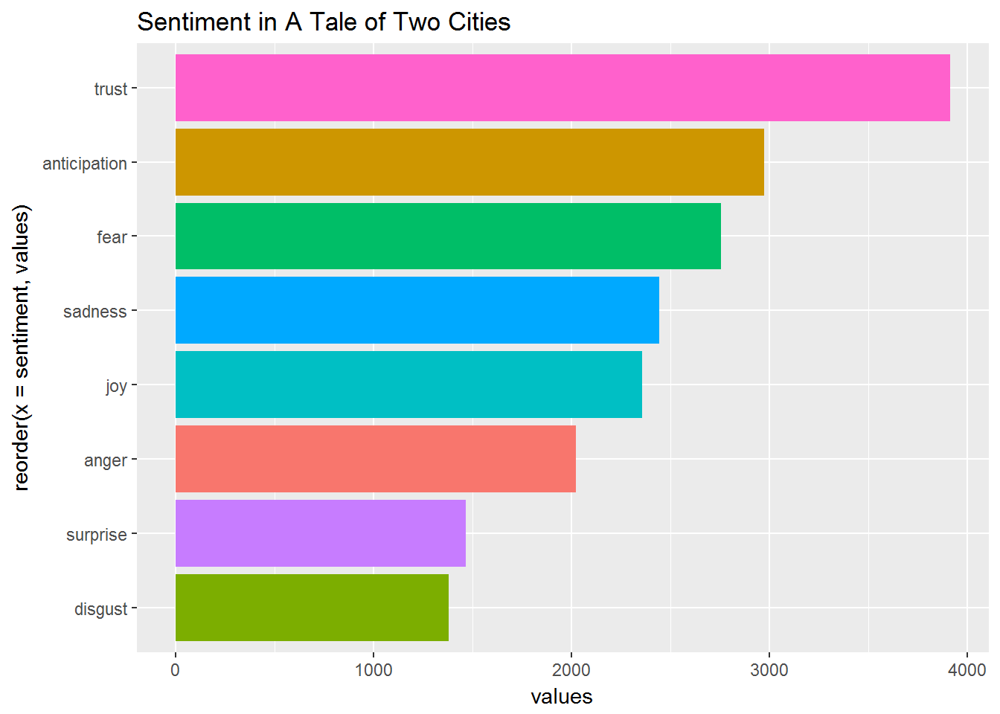

<div align="center">

</div>

> <p dir="RTL"> 
با استفاده از بسته gutenberg داده های لازم را به دست آورید و به سوالات زیر پاسخ دهید.
</p>

***

<p dir="RTL">
۱. چارلز دیکنز نویسنده معروف انگلیسی بالغ بر چهارده رمان (چهارده و نیم) نوشته است. متن تمامی کتاب های او را دانلود کنید و سپس بیست لغت برتر استفاده شده را به صورت یک نمودار ستونی نمایش دهید. (طبیعتا باید ابتدا متن را پاکسازی کرده و stopping words را حذف نمایید تا به کلماتی که بار معنایی مشخصی منتقل می کنند برسید.)
</p>


```{r q81, echo=FALSE,message=FALSE, warning=FALSE}
library(gutenbergr)
library(dplyr)
library(tm)
library(wordcloud)
library(stringr)
library(tidytext)
library(ggplot2)

ids = c(580, 730, 967, 700, 917, 968, 821, 766, 1023, 786, 963, 98, 1400, 883, 564)


dickens = list()
dickensbooks = list()

for (i in 1:length(ids)){
  
  x = ids[i]
  b  = gutenberg_download(x, meta_fields = "title")
  dickensbooks[[i]] = b
}


for (i in 1:length(ids)){

  book  = dickensbooks[[i]]
  book = book %>% 
    str_replace_all("[[:punct:]]"," ") %>% 
    str_split(pattern = "\\s") %>% 
    unlist() %>% 
    table() %>% 
    as.data.frame(stringsAsFactors = F)
  
  colnames(book) = c("word","count")
  
  book = book  %>% 
    filter(!str_to_lower(word) %in% stop_words$word) %>% 
    filter(nchar(word)>1) %>% 
    filter(!str_detect(word, "\\d")) %>% 
    mutate(proper = !word %in% str_to_lower(word)) %>%
    mutate(book_no = x)
  
  dickens[[i]] = book 
}

alls = bind_rows(dickens)

alls %>% filter(proper != TRUE) -> oth

oth %>% group_by(word) %>% summarise(totalCount = sum(count)) -> merged
merged = arrange(merged, -totalCount)


best = head(merged, 20)

ggplot(best, aes(x = reorder(word, totalCount) , y = totalCount)) + geom_col(fill = "purple", alpha = 0.8) + theme(axis.text.x = element_text(angle=-90, vjust=0.5)) + xlab("words") + ylab("count in all books")

```

***

<p dir="RTL">
۲. ابر لغات ۲۰۰ کلمه پرتکرار در رمان های چارلز دیکنز را رسم نمایید. این کار را با بسته wordcloud2 انجام دهید. برای دانلود می توانید به لینک زیر مراجعه کنید.
</p>

https://github.com/Lchiffon/wordcloud2

<p dir="RTL">
 با استفاده از عکسی که در ابتدا متن آمده ابر لغاتی مانند شکل زیر رسم کنید. (راهنمایی: از ورودی figpath در دستور wordcloud2 استفاده نمایید.مثالی در زیر آورده شده است.)
</p>

<div align="center">

</div>


<p dir="RTL">
به علت خوب کشیده نشدن عکس در کامپیوتر من، کد ضمیمه شده است.
</p>

```{r q82, echo=TRUE,message=FALSE, warning=FALSE}
library(gutenbergr)
library(dplyr)
library(tm)
library(wordcloud)
library(stringr)
library(tidytext)
library(ggplot2)
library(wordcloud2)

ids = c(580, 730, 967, 700, 917, 968, 821, 766, 1023, 786, 963, 98, 1400, 883, 564)


#dickens = list()
#dickensbooks = list()

#for (i in 1:length(ids)){
  
#  x = ids[i]
#  b  = gutenberg_download(x)
#  dickensbooks[[i]] = b
#}

for (i in 1:length(ids)){
  
  book  = dickensbooks[[i]]
  book = book %>% 
    str_replace_all("\"","") %>% 
    str_replace_all("[[:punct:]]","") %>% 
    str_split(pattern = "\\s") %>% 
    unlist() %>% 
    table() %>% 
    as.data.frame(stringsAsFactors = F)
  
  colnames(book) = c("word","count")
  
  book = book  %>% 
    filter(!str_to_lower(word) %in% stop_words$word) %>% 
    filter(nchar(word)>1) %>% 
    filter(!str_detect(word, "\\d")) %>% 
    mutate(proper = !word %in% str_to_lower(word)) %>%
    mutate(book_no = x)
  
  dickens[[i]] = book 
}

alls = bind_rows(dickens)

alls %>% filter(proper != TRUE) -> oth

oth %>% group_by(word) %>% summarise(totalCount = sum(count)) -> merged
merged = arrange(merged, -totalCount)


best = head(merged, 200)


wordcloud2(best, figPath = "~/Desktop/Data Analysis/hw_08/hw_08/images/dickens1_1.png" )
```

***

<p dir="RTL">
۳. اسم پنج شخصیت اصلی در هر رمان دیکنز را استخراج کنید و با نموداری تعداد دفعات تکرار شده بر حسب رمان را رسم نمایید. (مانند مثال کلاس در رسم اسامی شخصیت ها در سری هر پاتر)
</p>

```{r q83, echo=FALSE,message=FALSE, warning=FALSE, eval = FALSE}
library(gutenbergr)
library(dplyr)
library(tm)
library(wordcloud)
library(stringr)
library(tidytext)
library(ggplot2)

ids = c(580, 730, 967, 700, 917, 968, 821, 766, 1023, 786, 963, 98, 1400, 883, 564)


dickens = list()
dickensbooks = list()

for (i in 1:length(ids)){
  
  x = ids[i]
  b  = gutenberg_download(x, meta_fields = "title")
  dickensbooks[[i]] = b
}

for (i in 1:length(ids)){
  
  book  = dickensbooks[[i]]
  book = book %>% 
    str_replace_all("\"","") %>% 
    str_replace_all("[[:punct:]]","") %>% 
    str_split(pattern = "\\s") %>% 
    unlist() %>% 
    table() %>% 
    as.data.frame(stringsAsFactors = F)
  
  colnames(book) = c("word","count")
  
  book = book  %>% 
    filter(!str_to_lower(word) %in% stop_words$word) %>% 
    filter(nchar(word)>1) %>% 
    filter(!str_detect(word, "\\d")) %>% 
    mutate(proper = !word %in% str_to_lower(word)) %>%
    mutate(book_no = i) %>% filter(proper == TRUE) %>% arrange(-count)%>%
    filter(word != "Miss") %>% filter(word != "Sir") %>% 
    mutate(freq = 100 * count / sum(count))
  
  
  
  dickens[[i]] = head(book,5) 
}

alls = bind_rows(dickens)

for (i in 1:length(ids)){

  book  = dickens[[i]]
  ggplot(book, aes(x = reorder(word, count), y = freq)) + geom_col( fill = "purple", alpha = 0.5)+ xlab("Names") + ggtitle(dickensbooks[[i]]$title)
  
}
```


<div align="center">

</div>
<div align="center">

</div>
<div align="center">

</div>
<div align="center">

</div>
<div align="center">

</div>
<div align="center">

</div>
<div align="center">

</div>
<div align="center">

</div>
<div align="center">

</div>
<div align="center">

</div>
<div align="center">

</div>
<div align="center">

</div>
<div align="center">

</div>
<div align="center">

</div>
<div align="center">

</div>


***

<p dir="RTL">
۴.  در بسته tidytext داده ایی به نام sentiments وجود دارد که فضای احساسی لغات را مشخص می نماید. با استفاده از این داده نمودار ۲۰ لغت برتر negative و ۲۰ لغت برتر positive را در کنار هم رسم نمایید. با استفاده از این نمودار فضای حاکم بر داستان چگونه ارزیابی می کنید؟ (به طور مثال برای کتاب داستان دو شهر فضای احساسی داستان به ترتیب تکرر در نمودار زیر قابل مشاهده است.)
</p>

<div align="center">

</div>


```{r q84, echo=FALSE,message=FALSE, warning=FALSE, eval = FALSE}
library(gutenbergr)
library(dplyr)
library(tm)
library(wordcloud)
library(stringr)
library(tidytext)
library(ggplot2)

ids = c(580, 730, 967, 700, 917, 968, 821, 766, 1023, 786, 963, 98, 1400, 883, 564)


#dickens = list()
#dickensbooks = list()

#for (i in 1:length(ids)){
  
#  x = ids[i]
#  b  = gutenberg_download(x, meta_fields = "title")
#  dickensbooks[[i]] = b
#}

for (i in 1:length(ids)){
  
  book  = dickensbooks[[i]]
  book = book %>% 
    str_replace_all("\"","") %>% 
    str_replace_all("[[:punct:]]","") %>% 
    str_split(pattern = "\\s") %>% 
    unlist() %>% 
    table() %>% 
    as.data.frame(stringsAsFactors = F)
  
  colnames(book) = c("word","count")
  
  book = book  %>% 
    filter(!str_to_lower(word) %in% stop_words$word) %>% 
    filter(nchar(word)>1) %>% 
    filter(!str_detect(word, "\\d")) %>% 
    mutate(proper = !word %in% str_to_lower(word)) %>%
    mutate(book_no = x) %>% 
    filter(proper != TRUE) %>% arrange(-count)
  
  dickens[[i]] = book 
}

senti = na.omit(sentiments %>% select(word, sentiment) %>% filter(sentiment == "negative" | sentiment == "positive") %>% unique())

for (i in 1:length(ids)){
  v = dickens[[i]]
  v = full_join(v, senti)
  v = na.omit(v)
  v = arrange(v, -count)
  dickens[[i]] = v
}

for (i in 1:length(ids)){
  v = dickens[[i]]
  vpos = v %>% filter(sentiment == "positive") %>% head(20)
  vneg = v %>% filter(sentiment == "negative") %>% head(20)
  v = rbind(vpos, vneg)
  ggplot(v, aes(x = reorder(word, count), count, fill = sentiment)) + geom_col() + theme(axis.text.x = element_text(angle=-90, vjust=0.5)) + xlab("Words") + ggtitle(dickensbooks[[i]]$title) 
}

```


<div align="center">

</div>
<div align="center">

</div>
<div align="center">

</div>
<div align="center">

</div>
<div align="center">

</div>
<div align="center">

</div>
<div align="center">

</div>
<div align="center">

</div>
<div align="center">

</div>
<div align="center">

</div>
<div align="center">

</div>
<div align="center">

</div>
<div align="center">

</div>
<div align="center">

</div>
<div align="center">

</div>

***

<p dir="RTL">
۵. متن داستان بینوایان را به ۲۰۰ قسمت مساوی تقسیم کنید. برای هر قسمت تعداد لغات positive و negative را حساب کنید و سپس این دو سری زمانی را در کنار هم برای مشاهده فضای احساسی داستان رسم نمایید.
</p>

<p dir="RTL">
خط قرمز لغات مثبت و آبی منفی است.
</p>


```{r q85, echo=FALSE,message=FALSE, warning=FALSE}
library(gutenbergr)
library(dplyr)
library(tm)
library(wordcloud)
library(stringr)
library(tidytext)
library(ggplot2)


miser_raw  = gutenberg_download(135)


a = miser_raw %>% 
  str_replace_all("\"","") %>% 
  str_replace_all("[[:punct:]]","") %>% 
  str_split(pattern = "\\s")

a = a[[2]]


miserlist = list()
n = length(a)
m = as.integer(n / 200)
l = 1

for (i in 1:199){
  e = l + m
  p = a[l:e]
  l = l + m + 1
  miserlist[[i]]= p
}

miserlist[[200]] =a[l:n]
cleanlist = list()

senti = na.omit(sentiments %>% select(word, sentiment) %>% filter(sentiment == "negative" | sentiment == "positive") %>% unique())


allsent = data.frame(1,0,0)
names(allsent)<-c("part", "negative","positive")

for (i in 2:200){

miser = miserlist[[i]] %>% 
  unlist() %>% 
  table() %>% 
  as.data.frame(stringsAsFactors = F)

colnames(miser) = c("word","count")

miser = miser  %>% 
  filter(!str_to_lower(word) %in% stop_words$word) %>% 
  filter(nchar(word)>1) %>% 
  filter(!str_detect(word, "\\d")) %>% 
  mutate(proper = !word %in% str_to_lower(word)) %>%
  filter(proper != TRUE) %>%
  arrange(-count)

  miser = full_join(miser, senti)
  miser = na.omit(miser)
  cleanlist[[i]] = miser

  cleanlist[[i]] %>% group_by(sentiment) %>% summarise(t = sum(count)) -> v

  
  allsent[nrow(allsent) + 1,] = c(i, v[1,2], v[2,2])

}


ggplot(allsent) + geom_line(aes(x = part, y = negative, color = "blue")) + geom_line(aes(x = part, y = positive, color = "red")) + ylab("count")

```

***

<p dir="RTL">
۶. ابتدا ترکیبات دوتایی کلماتی که پشت سر هم می آیند را استخراج کنید و سپس نمودار ۳۰ جفت لغت پرتکرار را رسم نمایید.
</p>

```{r q86, echo=FALSE,message=FALSE, warning=FALSE}

library(gutenbergr)
library(dplyr)
library(tm)
library(wordcloud)
library(stringr)
library(tidytext)
library(ggplot2)
library(tidyr)


miser_raw  = gutenberg_download(135)

miser = miser_raw

for (i in 1:nrow(miser_raw)){
  x = miser_raw[i, 2]
  x = x %>% str_replace_all("[[:punct:]]"," ") 
  miser[i,2] = x
}

miser %>%  unnest_tokens(ngram, text, token = "ngrams", n = 2) %>% 
  count(ngram, sort = TRUE)  %>% 
  separate(ngram, c("word1", "word2"), sep = " ") %>%
  filter(!word1 %in% stop_words$word) %>% 
  filter(!word2 %in% stop_words$word) %>% 
  filter(!str_detect(word1, "^\\d+")) %>% 
  filter(!str_detect(word2, "^\\d+")) %>% 
  arrange(-n) -> miser


words = miser
words %>% filter(word1 != "chapter") %>% filter(word1 != "Chapter") -> words
fr = stopwords(kind = "fr")

words %>% filter(!word1 %in% fr) %>% filter(!word2 %in% fr) -> words

best = head(words, 30)
ggplot(best, aes(x = reorder(paste(word1 , word2),n), y = n)) + geom_col(fill = "purple") + theme(axis.text.x = element_text(angle=-90, vjust=0.5)) 

```

***

<p dir="RTL">
۷. جفت کلماتی که با she و یا he آغاز می شوند را استخراج کنید. بیست فعل پرتکراری که زنان و مردان در داستان های دیکنز انجام می دهند را استخراج کنید و نمودار آن را رسم نمایید.
</p>

<p dir="RTL">
به علت کم بودن سرعت اجرا در کتابهای دیکنز، از بینوایان استفاده شد.
</p>

```{r q87, echo=FALSE,message=FALSE, warning=FALSE}

library(gutenbergr)
library(dplyr)
library(tm)
library(wordcloud)
library(stringr)
library(tidytext)
library(ggplot2)
library(tidyr)

#miser_raw  = gutenberg_download(135)

miser = miser_raw

for (i in 1:nrow(miser_raw)){
  x = miser_raw[i, 2]
  x = x %>% str_replace_all("[[:punct:]]"," ") 
  miser[i,2] = x
}

stopss = stop_words %>% filter(word != "he") %>% filter(word != "she") 

miser %>%  unnest_tokens(ngram, text, token = "ngrams", n = 2) %>% 
  count(ngram, sort = TRUE)  %>% 
  separate(ngram, c("word1", "word2"), sep = " ") %>%
  filter(!word1 %in% stopss$word) %>% 
  filter(!word2 %in% stopss$word) %>% 
  filter(!str_detect(word1, "^\\d+")) %>% 
  filter(!str_detect(word2, "^\\d+")) %>% 
  arrange(-n) -> words

words %>% filter(word1 != "chapter") %>% filter(word1 != "Chapter") -> words
fr = stopwords(kind = "fr")

words %>% filter(!word1 %in% fr) %>% filter(!word2 %in% fr) -> words

words %>% filter(word1 == "she") %>% head(20)-> women
words %>% filter(word1 == "he") %>% head(20) -> men

ggplot(women, aes(x =word2, y = n)) + geom_col(fill = "purple") + theme(axis.text.x = element_text(angle=-90, vjust=0.5)) + xlab("verbs") + ylab("count")+ ggtitle("women")
ggplot(men, aes(x =word2, y = n)) + geom_col(fill = "purple") + theme(axis.text.x = element_text(angle=-90, vjust=0.5)) + xlab("verbs") + ylab("count")+ ggtitle("men")


```

***

<p dir="RTL">
۸. برای کتاب های دیکنز ابتدا هر فصل را جدا کنید. سپی برای هر فصل 
1-gram, 2-gram
را استخراج کنید. آیا توزیع  N-gram
در کارهای دیکنز یکسان است؟ با رسم نمودار هم این موضوع را بررسی کنید.
</p>

<p dir="RTL">
آزمون فرض 

chi-square

انجام شد و نتیجه آن پی ولیو ۱ بود.
پس نمیتوان گفت که متفاوتند.


همچنین نمودار توزیع ها نیز رسم شده که بسیار شبیه به هم هستند.
</p>

```{r q88, echo=TRUE,message=FALSE, warning=FALSE, eval = FALSE}
library(gutenbergr)
library(dplyr)
library(tm)
library(wordcloud)
library(stringr)
library(tidytext)
library(ggplot2)
library(tidyr)

ids = c(580, 730, 967, 700, 917, 968, 821, 766, 1023, 786, 963, 98, 1400, 883, 564)


dickens = list()
dickensbooks = list()

for (i in 1:length(ids)){
  
  x = ids[i]
  b  = gutenberg_download(x, meta_fields = "title")
  dickensbooks[[i]] = b
}


cleand = list()
for (i in 1:length(ids)){
  
  book  = dickensbooks[[i]]
  f = book
  for (j in 1:nrow(book)){
    x = book[j, 2]
    x = x %>% str_replace_all("[[:punct:]]"," ") %>%  str_replace_all("[^[:alpha:]]", " ")
    f[j,2] = x
  }
  cleand[[i]] = f
  
}


df = data.frame(1,2,3,4,5,6,7)
tries = list()
bis = list()
uns = list()

for (i in 1:length(ids)){

  res = cleand[[i]]

  res %>%  unnest_tokens(ngram, text, token = "ngrams", n = 2) %>% 
    count(ngram, sort = TRUE)  %>% 
    separate(ngram, c("word1", "word2"), sep = " ") %>%
    filter(!word1 %in% stop_words$word) %>% 
    filter(!word2 %in% stop_words$word) %>% 
    filter(!str_detect(word1, "^\\d+")) %>% 
    filter(!str_detect(word2, "^\\d+")) %>% 
    arrange(-n) -> bigram
    bigram$index<-seq(1:nrow(bigram))
    b<-glm(log(n) ~ log(index), family="gaussian", data=bigram)
    
    
    res %>%  unnest_tokens(ngram, text, token = "ngrams", n = 1) %>% 
      count(ngram, sort = TRUE)  %>% 
      separate(ngram, c("word1"), sep = " ") %>%
      filter(!word1 %in% stop_words$word) %>% 
      filter(!str_detect(word1, "^\\d+")) %>% 
      arrange(-n) -> unigram
     unigram$index<-seq(1:nrow(unigram))
    u<-glm(log(n) ~ log(index), family="gaussian", data=unigram)
    

    res %>%  unnest_tokens(ngram, text, token = "ngrams", n = 3) %>% 
      count(ngram, sort = TRUE)  %>% 
      separate(ngram, c("word1", "word2", "word3"), sep = " ") %>%
      filter(!word1 %in% stop_words$word) %>% 
      filter(!word2 %in% stop_words$word) %>%
      filter(!word3 %in% stop_words$word) %>% 
      filter(!str_detect(word1, "^\\d+")) %>% 
      filter(!str_detect(word2, "^\\d+")) %>%
      filter(!str_detect(word3, "^\\d+")) %>% 
      arrange(-n) -> trigram
    trigram$index<-seq(1:nrow(trigram))
    t<-glm(log(n) ~ log(index), family="gaussian", data=trigram)

    
    df[nrow(df) + 1,] = c(u$coefficients, b$coefficients, t$coefficients, 0)
    tries[[i]] = trigram
    bis[[i]] = bigram
    uns[[i]]= unigram
}  

View(df)
df = df[-1,]
backup = df
df$X1 = abs(df$X1)
df$X2 = abs(df$X2)
df$X3 = abs(df$X3)
df$X4 = abs(df$X4)
df$X5 = abs(df$X5)
df$X6 = abs(df$X6)
df$X7 = abs(df$X7)

chisq.test(df[,1:6])

i = 1
g1 = uns[[i]] %>% select(n) 
g2 = bis[[i]] %>% select(n) 
g3 = tries[[i]] %>% select(n) 

ggplot(data = g1, aes(x = n)) + geom_histogram(binwidth  = 1, fill = "purple", alpha = 0.7) + xlim(0,50) + ggtitle(paste("1-gram histogram of",dickensbooks[[i]]$title) )

ggplot(data = g2, aes(x = n)) + geom_histogram(binwidth  = 1, fill = "blue", alpha = 0.7) + xlim(0,20) + ggtitle(paste("2-gram histogram of",dickensbooks[[i]]$title) )

ggplot(data = g3, aes(x = n)) + geom_histogram(binwidth  = 1, fill = "red", alpha = 0.7) + xlim(0,10) + ggtitle(paste("3-gram histogram of",dickensbooks[[i]]$title) )


```


<div align="center">

</div>
<div align="center">

</div>
<div align="center">

</div>
<div align="center">

</div>
<div align="center">

</div>
<div align="center">

</div>
<div align="center">

</div>
<div align="center">

</div>
<div align="center">

</div>
<div align="center">

</div>


<div align="center">

</div>
<div align="center">

</div>
<div align="center">

</div>
<div align="center">

</div>
<div align="center">

</div>
<div align="center">

</div>
<div align="center">

</div>
<div align="center">

</div>
<div align="center">

</div>
<div align="center">

</div>


<div align="center">

</div>
<div align="center">

</div>
<div align="center">

</div>
<div align="center">

</div>
<div align="center">

</div>
<div align="center">

</div>
<div align="center">

</div>
<div align="center">

</div>
<div align="center">

</div>
<div align="center">

</div>


***

<p dir="RTL"> 
۹. برای آثار ارنست همینگوی نیز تمرین ۸ را تکرار کنید. آیا بین آثار توزیع n-grams در بین آثار این دو نویسنده یکسان است؟
</p>

<p dir="RTL">
آزمون فرض

chi-square 

انجام شد و نتیجه آن پی ولیو ۱ بود.
پس نمیتوان گفت که متفاوتند.

همچنین نمودار توزیع ها نیز رسم شده که بسیار شبیه به هم هستند.
</p>

```{r q89, echo=TRUE,message=FALSE, warning=FALSE, eval=FALSE}


library(gutenbergr)
library(dplyr)
library(tm)
library(wordcloud)
library(stringr)
library(tidytext)
library(ggplot2)
library(tidyr)

janeids = c(105, 121, 141, 158, 161, 1212, 1342)


jane = list()
janebooks = list()

for (i in 1:length(janeids)){
  
  x = ids[i]
  b  = gutenberg_download(x, meta_fields = "title")
  janebooks[[i]] = b
}


janecleand = list()
for (i in 1:length(janeids)){
  
  book  = janebooks[[i]]
  f = book
  for (j in 1:nrow(book)){
    x = book[j, 2]
    x = x %>% str_replace_all("[[:punct:]]"," ") %>%  str_replace_all("[^[:alpha:]]", " ")
    f[j,2] = x
  }
  janecleand[[i]] = f
  
}


janedf = data.frame(1,2,3,4,5,6,7)
tries = list()
bis = list()
uns = list()

for (i in 1:length(janeids)){
  
  res = janecleand[[i]]
  
  res %>%  unnest_tokens(ngram, text, token = "ngrams", n = 2) %>% 
    count(ngram, sort = TRUE)  %>% 
    separate(ngram, c("word1", "word2"), sep = " ") %>%
    filter(!word1 %in% stop_words$word) %>% 
    filter(!word2 %in% stop_words$word) %>% 
    filter(!str_detect(word1, "^\\d+")) %>% 
    filter(!str_detect(word2, "^\\d+")) %>% 
    arrange(-n) -> bigram
  bigram$index<-seq(1:nrow(bigram))
  b<-glm(log(n) ~ log(index), family="gaussian", data=bigram)
  
  
  res %>%  unnest_tokens(ngram, text, token = "ngrams", n = 1) %>% 
    count(ngram, sort = TRUE)  %>% 
    separate(ngram, c("word1"), sep = " ") %>%
    filter(!word1 %in% stop_words$word) %>% 
    filter(!str_detect(word1, "^\\d+")) %>% 
    arrange(-n) -> unigram
  unigram$index<-seq(1:nrow(unigram))
  u<-glm(log(n) ~ log(index), family="gaussian", data=unigram)
  
  
  res %>%  unnest_tokens(ngram, text, token = "ngrams", n = 3) %>% 
    count(ngram, sort = TRUE)  %>% 
    separate(ngram, c("word1", "word2", "word3"), sep = " ") %>%
    filter(!word1 %in% stop_words$word) %>% 
    filter(!word2 %in% stop_words$word) %>%
    filter(!word3 %in% stop_words$word) %>% 
    filter(!str_detect(word1, "^\\d+")) %>% 
    filter(!str_detect(word2, "^\\d+")) %>%
    filter(!str_detect(word3, "^\\d+")) %>% 
    arrange(-n) -> trigram
  trigram$index<-seq(1:nrow(trigram))
  t<-glm(log(n) ~ log(index), family="gaussian", data=trigram)
  
  
  janedf[nrow(janedf) + 1,] = c(u$coefficients, b$coefficients, t$coefficients, 0)
  tries[[i]] = trigram
  bis[[i]] = bigram
  uns[[i]]= unigram
}  

View(janedf)
janedf = janedf[-1,]

df = janedf

df$X1 = abs(df$X1)
df$X2 = abs(df$X2)
df$X3 = abs(df$X3)
df$X4 = abs(df$X4)
df$X5 = abs(df$X5)
df$X6 = abs(df$X6)
df$X7 = abs(df$X7)

chisq.test(df[,1:6])

i = 0

i = i + 1
g1 = uns[[i]] %>% select(n) 
g2 = bis[[i]] %>% select(n) 
g3 = tries[[i]] %>% select(n) 

ggplot(data = g1, aes(x = n)) + geom_histogram(binwidth  = 1, fill = "purple", alpha = 0.7) + xlim(0,50) + ggtitle(paste("1-gram histogram of",janebooks[[i]]$title) )

ggplot(data = g2, aes(x = n)) + geom_histogram(binwidth  = 1, fill = "blue", alpha = 0.7) + xlim(0,20) + ggtitle(paste("2-gram histogram of",janebooks[[i]]$title) )

ggplot(data = g3, aes(x = n)) + geom_histogram(binwidth  = 1, fill = "red", alpha = 0.7) + xlim(0,10) + ggtitle(paste("3-gram histogram of",janebooks[[i]]$title) )


```


<div align="center">

</div>
<div align="center">

</div>
<div align="center">

</div>
<div align="center">

</div>
<div align="center">

</div>


<div align="center">

</div>
<div align="center">

</div>
<div align="center">

</div>
<div align="center">

</div>
<div align="center">

</div>


<div align="center">

</div>
<div align="center">

</div>
<div align="center">

</div>
<div align="center">

</div>
<div align="center">

</div>


***

<p dir="RTL"> 
۱۰. بر اساس دادهایی که در تمرین ۸ و ۹ از آثار دو نویسنده به دست آوردید و با استفاده از  N-gram ها یک مدل لاجستیک برای تشخیص صاحب اثر بسازید. خطای مدل چقدر است؟ برای یادگیری مدل از کتاب کتاب الیور تویست اثر دیکنز و کتاب پیرمرد و دریا استفاده نکنید. پس از ساختن مدل برای تست کردن فصل های این کتابها را به عنوان داده ورودی به مدل بدهید. خطای تشخیص چقدر است؟
</p>

<p dir="RTL"> 
طبق قانون 
freq = a / index


 N-gram در 
 ها
 میزان تکرار یک ترکیب متناسب با رنک آن در بین ترکیب ها که به صورت نزولی بر اساس تکرار مرتب شده اند، است.
 حال از دو طرف اگر لگاریتم بگیریم، تکرار با رنک رابطه ای خطی دارد.
 ضرایب ثابت این رابطه خطی را پیدا میکنیم و برای هر  N-gram یک کتاب نویسنده آن را ذخیره میکنیم.
 حال داده ما متشکل از چند کتاب است که هر کدام چند ضریب دارد.
 با استفاده از آن مدل لاجیستیک را میسازیم و کتابهای دیگر را تخمین میزنیم.
 اگر مرز دسته بندی را ۰ بگذاریم این دسته بندی درست تخمین میزند.
</p>

```{r q810, echo=TRUE,message=FALSE, warning=FALSE, eval = FALSE}

dickens = backup
jane = janedf
jane$X7 = 1

select1 = jane[1,]
select2 = dickens[1,]
select3 = dickens[2,]
jane = jane[-1,]
dickens = dickens[-1,]

dickens = dickens[-1, ]
all = rbind(dickens, jane)
View(all)

fit = glm(X7 ~ X1 + X2 + X3 + X4 + X5 + X6 , family = "binomial", data = all)

predict(fit,select1[,1:6]) # -> -13
predict(fit,select2[,1:6]) # -> -69
predict(fit,select3[,1:6]) # -> 30

# -> negative : dickens positibve = jane austin
```